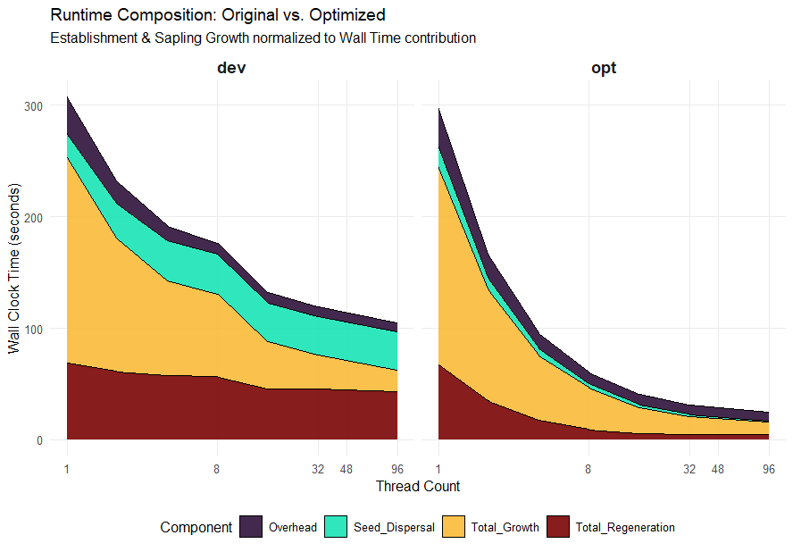
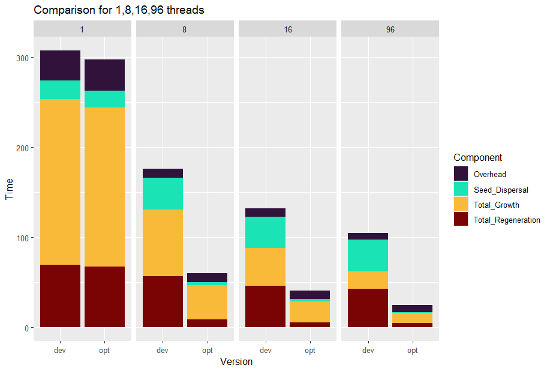
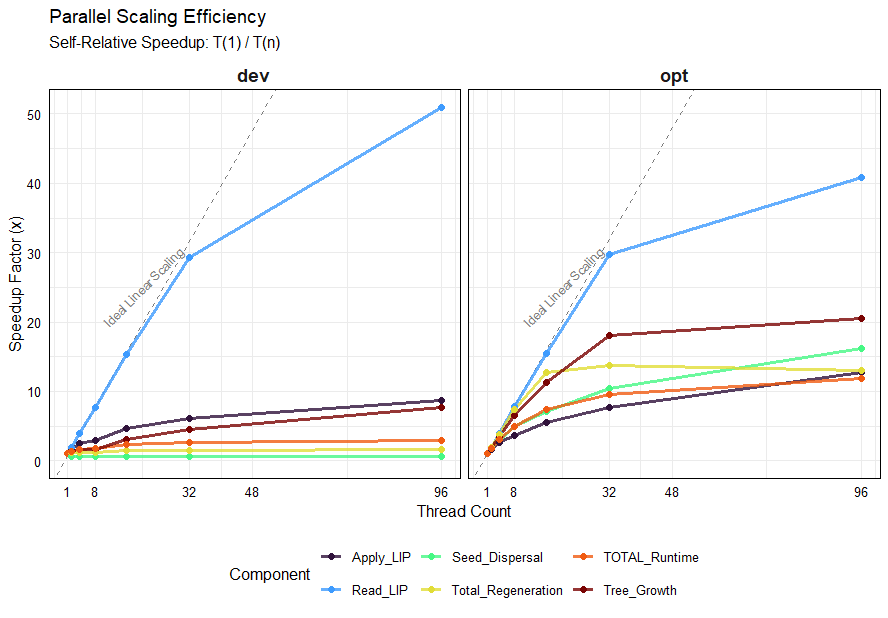
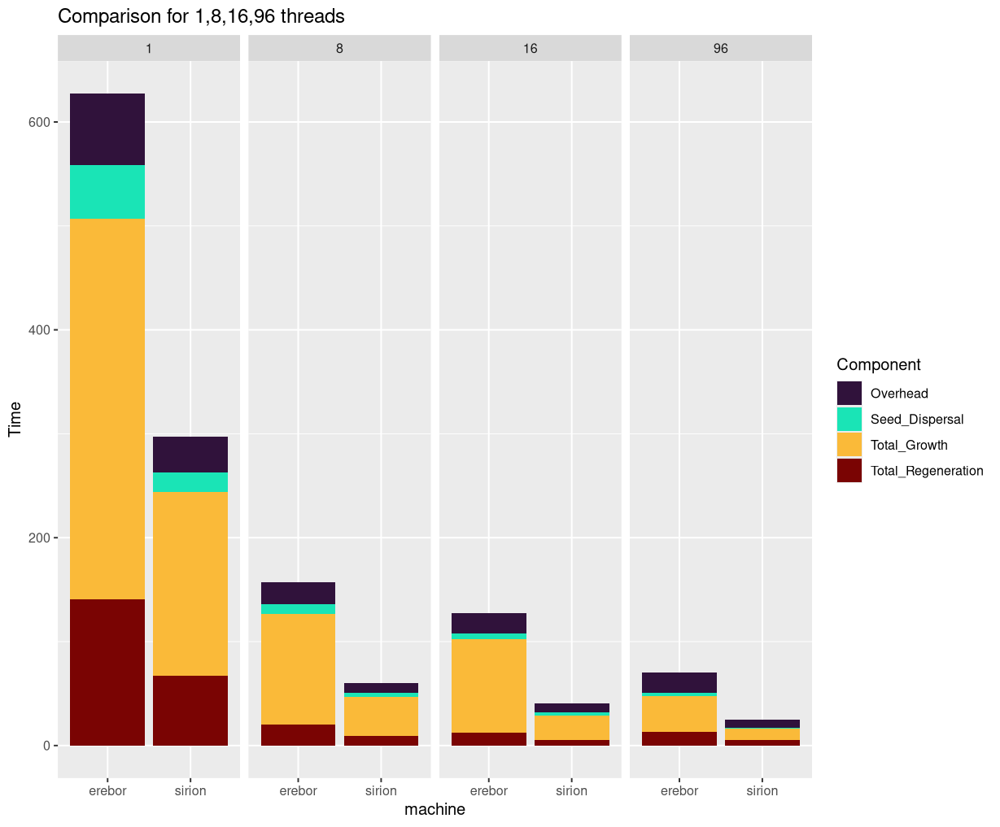

# iLand Performance Optimization Report

*Summary of performance-related architecture changes in the 'understorey' branch (December 2025).*

## Abstract

Recent development on the iLand understory module prompted a re-evaluation of the model's performance characteristics on modern high-core-count server architectures. While iLand has successfully utilized multi-threading for years, the increase in core counts (48–96+) revealed new bottlenecks. This report details the transition from a lock-limited architecture to a memory-bandwidth-optimized design. The resulting optimizations yield a **4.2x speedup** on 96 threads compared to the previous development version, and a **12x speedup** for specific memory-bound processes.

---

## 1. The Challenge: Compute vs. Memory Bound

In an ideal theoretical model, algorithms scale linearly with the number of execution cores. However, in ecological modeling, computations are frequently **memory-bound** rather than **compute-bound**. Performance is limited not by CPU cycle count, but by the rate at which data can be transferred from RAM to the L1/L2/L3 caches.

Furthermore, on massive-core systems, traditional synchronization primitives (global locks, shared counters) introduce **hardware serialization**. The focus of this optimization effort shifted from minimizing instruction counts to optimizing data locality, memory alignment, and cache coherency.

---

## 2. Performance Metrics & Test Setup

### Key Processes

The runtime budget of iLand is dominated by five categories:

1. **Light Competition (`Apply_LIP`, `Read_LIP`):** Pattern-based light calculations involving heavy grid read/write operations.
2. **Tree Growth:** Biological processes (growth, mortality, allocation) calculated per individual tree.
3. **Seed Dispersal:** Large-scale spatial operations involving 2D grids and kernel convolution.
4. **Regeneration:** High-resolution (2x2m) establishment and sapling dynamics.
5. **Overhead:** Climate processing, outputs, and disturbance modules.

### Test Environment

The benchmarks compare the **"dev"** version (Legacy architecture, Dec 2025) against the **"opt"** version (Optimized 'understory' branch, Dec 3rd, 2025).

**Scenario:** Bayrischer Wald landscape, 30-year simulation from current vegetation, including disturbance (wind, bark beetle) and full outputs.

**Hardware:**
* **System A ("Sirion"):** Single-Socket AMD EPYC 9454P (48 Cores / 96 Threads). Optimized for frequency and bandwidth-per-core.
* **System B ("Erebor"):** Dual-Socket AMD EPYC 9654 (192 Cores total). Optimized for density.

---

## 3. Results

### 3.1. Overall Scaling

The optimization effort successfully decoupled the model from thread-contention bottlenecks. While single-threaded performance remains similar between versions, the multi-threaded scaling has improved dramatically.

**Figure 1** (Overview) illustrates the total runtime reduction.

**Figure 2** (Direct Comparison) highlights the efficiency gap. While the "dev" version achieves a 3x speedup going from 1 to 96 threads (307s to 105s), the "opt" version achieves a **12x speedup** (299s to 25s).

### 3.2. Component Scaling Analysis

Figure 3 breaks down the speedup factor ($T_1 / T_n$) for key components.

* **Tree Growth (CPU Bound):** Previously limited by a shared Random Number Generator (RNG) lock, this process now scales near-linearly (Speedup > 20x) after implementing thread-local RNG buffers.
* **Seed Dispersal (Memory Bound):** The legacy implementation exhibited negative scaling due to massive write-contention on the global map. The new **Tiled Architecture** (detailed below) converts this into a cache-resident operation, achieving a **97% runtime reduction** at peak load.
* **Apply_LIP:** This remains the primary bottleneck. It shows sub-linear scaling, characteristic of tasks saturating the physical memory bandwidth of the server.

---

## 4. Technical Implementation Details

### 4.1. Parallelization Architecture: Tiled Seed Dispersal

**Problem:** The seed dispersal algorithm performs a sparse convolution on a 20m resolution grid. The previous approach "scattered" seeds from source trees to the global map. With 96 threads, this caused massive cache thrashing (L3 cache capacity exceeded) and write-amplification to main RAM.

**Solution:** An Output-Centric Tiled Approach.

The landscape is partitioned into N tiles with a size of $64 \times 64$ pixels (effectively ~160ha) tiles (fitting within L1 Cache) (unless the landscape < 100 ha, and only if not in Torus-mode).
1. Each thread claims a tile at a time.
2. All potential source cells for that tile are identified.
3. Dispersal is calculated into a Local Stack Buffer (L1 Cache).
4. The finished tile is written to Main RAM exactly once.

This reduced RAM write traffic by orders of magnitude, effectively uncapping the performance limit.

### 4.2. Combined Regeneration Phase

**Problem:** Establishment, sapling growth, and understory dynamics were executed as separate passes over the Resource Units (RUs). This forced the CPU to reload data from RAM multiple times and perform double light calculations. This became untenable with adding understory.

**Solution:** These phases were fused into a single super-task (`nc_full_regeneration_phase`), and light calculations are done once and stored in a thread-local buffer object:
* **Pipeline:** Light Profile -> Establishment -> Sapling Growth -> Understory.
* **Benefit:** Temporal locality is preserved. Data for the RU remains "hot" in L1/L2 cache throughout the entire biological cycle.

### 4.3. Lock-Free Random Number Generation

**Problem:** The legacy RNG used a shared large buffer with a single global counter variable. With multiple threads, high-frequency RNG consumers (like mortality checks) caused severe write-access contention, effectively serializing the execution.

**Solution:** Transitioned to Thread-Local Storage (TLS). Each thread now maintains its own independent, small state buffer. This eliminates the "stop-the-world" synchronization events entirely.

### 4.4. Memory Layout & Alignment

**Problem:** The `SaplingCell` struct (2x2m) had an arbitrary size, causing objects to straddle CPU cache lines. This triggered double-fetches and "False Sharing" (where Thread A modifying Cell 1 invalidates the cache line for Cell 2 held by Thread B).

**Solution:**
* **Alignment:** Structs are now aligned to exactly 64 bytes (`alignas(64)`), matching the hardware cache line size.
* **Bitpacking:** State data compressed using bit-fields (`uint32_t : 8`) to fit critical data within a single cache line fetch.

---

## 5. Hardware Architecture Analysis: Sirion vs. Erebor

We conducted comparative benchmarks on two server architectures to understand hardware affinity.

**Result:** The Single-Socket machine ("Sirion", 48 Cores) significantly outperformed the Dual-Socket machine ("Erebor", 192 Cores), despite the latter having 4x the theoretical core count.

### Analysis

This counter-intuitive result can be explained by Bandwidth Dilution and NUMA (Non-Uniform Memory Access) penalties.
1. **Bandwidth-per-Core:** iLand's grid operations are memory-intensive. Sirion provides a high ratio of Memory Channels to Cores (approx 1 channel per 4 cores). Erebor, designed for density, forces 8 cores to share a channel, starving the compute units.
2. **NUMA Penalty:** On the dual-socket Erebor, threads on Socket 0 accessing grid data stored on Socket 1 must traverse the inter-socket interconnect, incurring high latency and congestion.
3. **Frequency:** The high-density CPU has a lower base clock and less aggressive boost behavior compared to the frequency-optimized Sirion CPU.

**Conclusion:** For tightly-coupled, memory-bound scientific simulations like iLand, memory bandwidth per core is a more critical performance predictor than raw core count.
