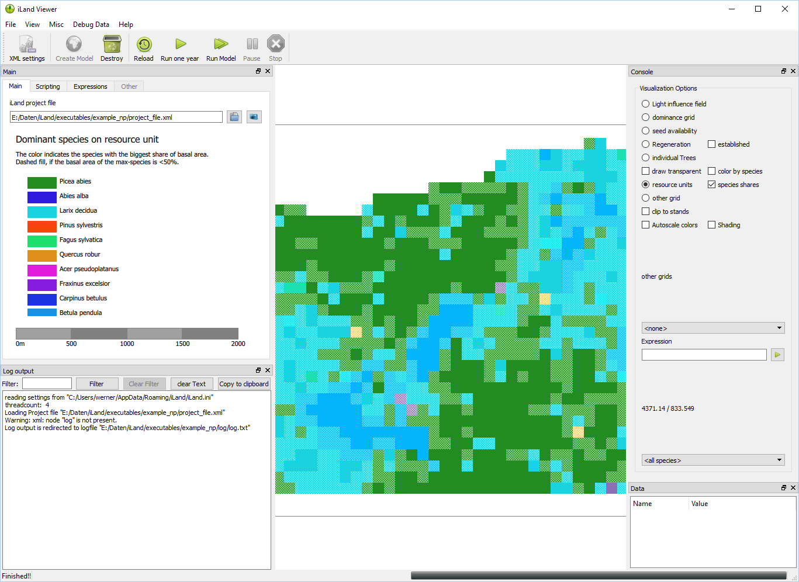

Welcome to the central hub for navigating the iLand (individual-based forest landscape and disturbance model) documentation.

## About the Model

iLand is a process-based model of forest ecosystem dynamics, simulating processes like **growth**, **mortality**, and **regeneration** at watershed-to-landscape scales. Individual tree competition for resources and environmental influences on forest processes are explicitly modeled. 

The model is designed to investigate the effects of climatic changes on forest ecosystem dynamics, with a particular focus on natural disturbances, and to harness these capacities for questions of sustainable forest management under changing environmental conditions.

::: {.callout-note}
### Quick Navigation Links
The following table provides quick links to the key scientific components of iLand.
:::

| Resources & Growth | Mortality & Regeneration | Application & Scaling |
| :--- | :--- | :--- |
| [Growth](wiki/growth.qmd) | [Mortality](wiki/mortality.qmd) | [Parametrization](wiki/parameterization.qmd) |
| [Resource Availability & Competition](wiki/resource-availability-and-competition.qmd) | [Regeneration](wiki/regeneration.qmd) | [Evaluation](wiki/evaluation.qmd) |
| [Constraints to Resource Utilization](wiki/constraints-to-resource-utilization.qmd) | [Management (ABE)](wiki/management.qmd) | [Scaling across space/time](wiki/scaling.qmd) |
| [Soil Dynamics](wiki/soil-dynamics.qmd) | | |

---

## About the Implementation

The iLand modeling software is written in C++ using the **Qt** toolkit. Key development goals are high computational performance, a rich GUI, and extended scripting facilities.

{width=450px}

### References

| Component | Description |
| :--- | :--- |
| [Project File](wiki/project-file.qmd) | The main configuration file for simulated landscapes (XML format). |
| [Species Parameters](wiki/species-parameter.qmd) | Description of species-specific parameters in iLand. |
| [Tree Variables](wiki/tree-variables.qmd) & [RU Variables](wiki/resource-unit-variables.qmd) | Reference lists of variables accessible via scripting and expressions. |
| [Outputs](wiki/outputs.qmd) & [Debug Outputs](wiki/debug-outputs.qmd) | Technical description of iLand outputs. |
| [Javascript API Docs](apidoc/index.qmd) | Unified reference for the C++ Javascript API bindings (e.g., [Grid](apidoc/classes/grid.qmd)). |

---

## Frequent Tasks & Specialized Content

| Category | Topics |
| :--- | :--- |
| **Common Workflows** | [Scripting in iLand](wiki/scripting.qmd) \| [Landscape Initialization](wiki/initialization.qmd) \| [Using iLand Viewer & Console](wiki/iland-software.qmd) |
| **Extended Modules** | [Disturbance Modules (Fire, Wind, Beetles)](wiki/disturbance-modules.qmd) \| [Agent-Based Management Engine (ABE)](wiki/abe.qmd) |

---

## Additional Resources

### [iLand Book](https://iland-model.org/iland-book)
The *iLand Book* is a companion resource built with Quarto. It provides a compact, guided introduction for both beginners and advanced users, covering how to get started with the model and parameterize new species.

### Community & Support
The community of iLand users is active on Discord. You can join the conversation via the invite link:
*   [Join iLand Discord Channel](https://discord.gg/e5trneUKav)
