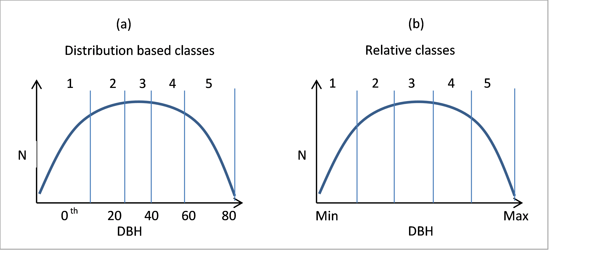

Thinning activities are management operations with a specific part of the trees being harvested, usually aiming for increased stand stability, improved composition, and wood quality. ABE provides several types of thinnings; several parameters are available providing a fine grained control over the details of the selection of trees. Thinning activities are scheduled activities per default.
The property *thinning* specifies the type of the thinning. Each thinning type has different specific settings.


| **Type** | **Description** |
| --- | --- |
| fromBelow | (not implemented yet) |
| fromAbove | (not implemented yet) |
| custom | Custom thinning which gives the user a lot of control over the tree selection. Generally, trees are selected based on dbh (or volume) classes. |
| selection | (not implemented yet) |

 


### Custom thinning


The custom thinning provides a very general interface for selecting a subset of the trees for harvesting. In very general terms, the user defines the planned harvest in either relative or absolute classes along a number of optional constraints/ settings.
Figure 1 shows the concept of distribution based vs. relative classes. The parameter percentile selects the required mode.


Figure 1. Example with 5 classes based on percentiles (a) and as relative classes (b). For (a), the classes 1 to 5 are defined by the 20th, the 40th, the 60th, the 80th percentile of the DBH distribution of the stand. Hence, every class contains (roughly) the same number of trees. For relative classes (b), each class spans the same diameter range, but the classes do not host an equal number of trees.

Class values can relate to relative or to absolute values, and refer either to trees that should be removed or trees that should remain on site. The requested behavior is controlled by the parameters -+remove+- and -+relative+-.

 


| **property** | **Description** | **Default** |
| --- | --- | --- |
| filter | String that is used as additional filtering criterion when trees are loaded. This can be used, e.g., to select only a specific tree species. The usual tree variables are available. If empty, no filter is applied. |  |
| percentile | if *true*, classes relate to percentiles (i.e., values between 0 and 100) of the dbh distribution. *false* indicates relative dbh classes, i.e., evenly sized classes between the minimum and maximum dbh on the stand. | true |
| removal | if *true*, the given classes define which trees are to be removal; if *false*, the classes define the portion of trees that should remain on site (NOT IMPLEMENTED) | true |
| relative | Specifies if class values are proportions (given in per cent, *true*) or in absolute values (*false*). See also -+targetValue+-. | true |
| minDbh | A minimum diameter threshold (cm). If provided, trees below -+minDbh+- are not considered (and therefore do not interfere with relative dbh classes).%%%Can be numeric, expression, or Javascript function. | 0 (no limit) |
| remainingStems | If provided, -+remainingStems+- defines the minimum number of stems / ha (above -+minDbh+-) that need to remain on site.%%%Can be numeric, expression, or Javascript function. | 0 (no limit) |
| targetValue | Defines the target of the removal. Interpretation depends on -+targetRelative+- and -+targetVariable+-. If -+targetValue+- is 0, the check against the target value is deactivated, i.e., the removals are based only on the classes. Can be numeric, expression, or Javascript function. | 30 |
| targetVariable | Sets which variable is used for removals. Possible values are (the strings) ‘stems’, ‘basalarea’, or ‘volume’ | stems |
| targetRelative | If set to *true*, the -+targetValue+- is given as relative to the stock (in per cent, e.g. 40% of the -+targetVariable+-); otherwise -+targetValue+- is interpreted as an absolute value (targetVariable / ha). | true |
| classes | A JavaScript array defining the removal in the classes. The number of classes is defined by the number of values in the array. If relative classes are used, the sum of all class values needs to be 100. The first number refers to the class with the smallest values (e.g., dbh) | (required) |


The user can use multiple thinning definitions within a single thinning activity. This allows, e.g., specific parameter values for different species. This can be achieved by specifying an array of thinning definitions using the -+thinnings+- -property.


### Examples


The definition of thinning activities is very flexible; some examples are below.


Example 1:


```javascript
thinning: { type: 'thinning',
        schedule: { min: 55, opt: 65, max: 75 },
        constraint: ["stand.dbh>15"],
        thinning: 'custom',
        targetValue: 30, targetVariable: 'volume', targetRelative: true,
        minDbh: 10,
        classes: [10, 30, 25, 30, 5]
    }
```

The activity explained:

* it requires a mean stand DBH of 15cm (if 15cm are not reached until age 75, the activity is omitted)
* it does not process any trees with a DBH < 10 (the lowest class contains trees from 10cm onwards)
* specifies 5 volume (-+targetVariable+-) classes; the lowest class spans from the 1st to the 20th percentile, the upper class trees within the 80th to the 100th percentile.
* it tries to remove 30% of the volume ( -+targetValue+-, -+targetVariable+-, -+targetRelative+-), of which 10% of the trees are taken from the lowest class, 30% from the second, and so forth.

Example 2:


```javascript
thinning:{ type: 'thinning',
        schedule: { min: 55, opt: 65, max: 75, force: true },
        thinning: 'custom',
remainingStems: 400, targetValue: 100,
        classes: [40, 30, 10, 10, 10]
    },
```

This thinning activity removes trees until 400 trees/ha remain. The removal is concentrated in the lower classes. Note that the targetValue (100% of the trees) is not reached, but needs to be specified in order to override the default value.

Example 3:

```javascript
thinning: {
		type: 'thinning',
		schedule: { repeat: true, repeatInterval: 10 },
		thinning: 'custom',
		targetVariable: 'basalarea',
		targetRelative: false, // absolute target, since we calculate directly m2
		targetValue: function() { return calcBasalAreaToRemove(); },
		classes: [ 40, 30, 10, 10, 10 ],
		onExecuted: function() { fmengine.log('thinnging called, year ' + Globals.year); },
		onSetup: function() { stand.trace = true;  }
    }

// outside of the definition of the agent:
function calcBasalAreaToRemove() {
	var to_remove = stand.basalArea - 15;
	fmengine.log("try to remove " + to_remove + " m2, total ba now: " + stand.basalArea);
	return to_remove;
}
```

 
This example shows:

* The thinning repeats every 10 yrs
* it uses a dynamic function to calculate the amount of basal area that should be removed, i.e., every time it removes trees until a basal area of 15m2/ha is reached. Note that the code in `calcBasalAreaToRemove()` could also be directly included the activity
* for debugging, `trace` is enabled for this activity, i.e., there will be detailed log messages


### Setting target species composition


During tending phases, one of the major goals of forest management is to modify the species composition to better comply to the target species composition. In reality, this process is quite complex and includes many detailed decisions (which trees to keep and/or liberate, should extra trees be planted, and if so, where, ...). An approach to mimic this in iLand is given in [this example](abe-example-setting-target-species-composition.qmd). This also demonstrates some advanced interactions between custom Javascript, ABE and iLand.

 


::: {.callout-note title="citation"}
[Rammer, W., Seidl, R., 2015](http://dx.doi.org/10.1016/j.gloenvcha.2015.10.003). Coupling human and natural systems: Simulating adaptive management agents in dynamically changing forest landscapes. Global Environmental Change, 35, 475-485.
:::

 