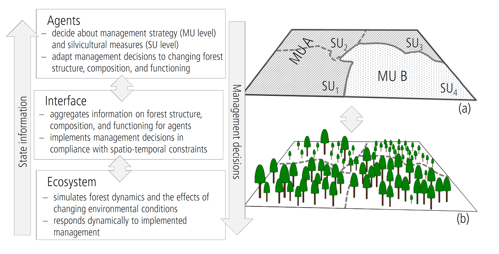

### Setting up the ABE management system

The following figure demonstrates the interaction of the landscape as seen from the process based forest model (iLand) and from the agent based forest management module (ABE). This page describes the spatial setup of the latter. The [ABE minimal setup](abe-minimal-setup.qmd) page provides practical information for the minimum setup of ABE.

The right part of the figure is an example for a typical spatial organisation:

* the (forested) landscape is divided into forest stands (stand units (SU) 1 to 4)
* a management unit (MU) comprises of several stands (e.g., MU A, MU B). Management units typically share the main climate/site characteristics and the management strategy
* agents can be responsible for the management of one or multiple management units

This hierarchical structure is very flexible; typical use cases can be:

* each forest stand is managed by a different owner ("smallscale owners"). Each management unit consists of exactly one stand.
* the whole landscape is one unit and managed by one agent ("largescale owner, homogenous conditions")
* everything in between these to extremes: e.g., one agent (a large company), but several units based on a climate / site classification. The STPs can differ between units (e.g., different rotation periods, target species, ...)

### spatial organisation

The base of the spatial organisation is defined by the [stand grid](landscape-setup.qmd). This grid (cell size of 10m) assigns a numerical *stand ID* to each 10m pixel of the simulated landscape. This input layer can usually be derived from available GIS data. The stand grid tends to be constant during a simulation (with the exception that heavily disturbed stands may be [divided](abe-activity-salvage.qmd)).
A input data table is used to assign each stand of the stand grid to units and agents. The file name of the text file is defined using the -+agentDataFile+- node of the [project file](project-file.qmd).

The *agentDataFile* can have the following fixed columns:

| **Column** | **Description** |
| --- | --- |
| id | *stand ID* of a polygon in the stand grid |
| unit | name of the unit (string) to which the polygon *id* belongs |
| agent | name of the managing agent (string) *or* (see below for details) |
| agentType | name of the agent type (string) (see below for details) |
| stp | name (string) of the STP for the stand "id" |
| age | the stand age; if omitted iLand estimates the initial age for each stand from the tree population. |
| U | the current rotation age of the stand (see notes below) |

Note: if the *agentDataFile* contains additional columns, then the values are automatically assigned to each stand as stand properties and can thus be accessed in Javascript (see [stand.flag() method](../apidoc/classes/abe/stand.qmd)).

There are two ways of specifying the *Agent* for each polygon:

* you can specify an agent directly with the name of the agent in the 'agent' column of the *agentDataFile*. In this case, the agent has to created manually and registered by calling the Javascript function [fmengine.addAgent()](../apidoc/classes/abe/fmengine.qmd).
* alternatively, you specify the agent type (the *agentType* column in the *agentDataFile*). In this case, a agent of the given agent type will be created on the fly.
* both approaches can be mixed; e.g. you could define small scale farmers on one part of the landscape (with an separate agent for each stand), and a big company with a single agent that manages multiple stands on another part of the landscape

An agent may select a STP from a list of available STPs for the polygon dynamically (*on<x>select* event of the [Agent](abe-agents.qmd)). However, the initial STP can be defined in the *agentDataFile* which overrules the decision logic of the agent.

The effective rotation length (U) can be set differently. First, the value of the "U" column in the CSV file is used; if not set, then the default U of the assigned STP is used (if a STP is assigned in the data file). Else the U value of the unit is assigned (which is the U of the default STP from the managing agent). In addition to that, U can be set programmatically via Javascript.

 

::: {.callout-note title="citation"}
[Rammer, W., Seidl, R., 2015](http://dx.doi.org/10.1016/j.gloenvcha.2015.10.003). Coupling human and natural systems: Simulating adaptive management agents in dynamically changing forest landscapes. Global Environmental Change, 35, 475-485.
:::

 
