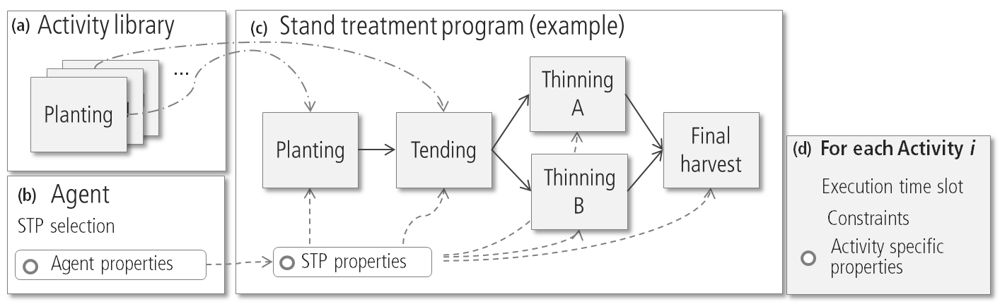

The main constituent of a stand treatment program is a collection of activity objects, typically covering the silvicultural treatments to regenerate, tend and thin, and harvest a stand. ABE provides a library of pre-defined silvicultural activities, from which [activities](abe-activities.qmd) can be selected and combined to STPs. In addition, the STP includes a definition of a time window for each activity, from which ABE autonomously derives the sequence and preliminary time of execution for each activity. In addition, the STP declaration includes properties that can influence the behavior of activities, e.g., the default rotation length, providing an efficient means to link management decisions on management unit level to actual stand level management.

A “Stand Treatment Program” (STP) can be thought of as a “management regime” or “management system”. It defines a management (for a specific forest type) by combining different “activities” for the respective stages of forest development (regeneration, tending, thinning …).
One important property of a forest management agent is the set of available STPs: for example, some agents may be able to use more sophisticated techniques than others.


**Figure**: The stand treatment program (STP) (c) can be seen as a collection of activities selected from the "library" (a). The STP does also define the execution time (slot) and other properties (e.g., constraints) for each activity (d). The detailed behavior of activities can depend on properties of the stand, the STP, or properties of the agent (b).

Technically, a STP is defined as a Javascript object:


```javascript
var stp = {
	activity_name1: <activity object 1>,
	activity_name2: <activity object 2>,…,
 	activity_nameN: <activity object N>,
 …: <STP specific events >
 …: <STP specific properties >
 options: { avaialable STP specific properties for JS},
 U:  [u-min, u-mean, u-max],
}
```


| **Property** | **Description** |
| --- | --- |
| U | Provide an array of three values given the short, default, and long rotation period, respectively. When an agent decides to update -+U+- (i.e., use the short, default, or long U), the respective values are used for stands managed by this STP. |
| options | The *options* object provides a mean for options that are specific to a STP. Within JS-code, the options of the stp can be accessed using -+stp.options+- (see example below). |


```javascript
// definition of the STP
var stp: { U: [110, 130, 150], // define the rotation period
	clearcut: a_clearcut, // some activities
	options: { dbh: 5, someOtherParameter: 50}
}

// definition of activities… here the ‘dbh’ options is used
// in the Javascript code to select trees to harvest.
var a_clearcut: {
   type: "scheduled", … ,
   onEvaluate: function() {
            trees.loadAll();
            trees.harvest("dbh>" + stp.options.dbh );}
         }
};
```


## Events


The ABE system provides specific events for stand treatment programs:


| **Event** | **Description** |
| --- | --- |
|  | onInit |
|  | onExit |


::: {.callout-note title="citation"}
[Rammer, W., Seidl, R., 2015](http://dx.doi.org/10.1016/j.gloenvcha.2015.10.003). Coupling human and natural systems: Simulating adaptive management agents in dynamically changing forest landscapes. Global Environmental Change, 35, 475-485.
:::

