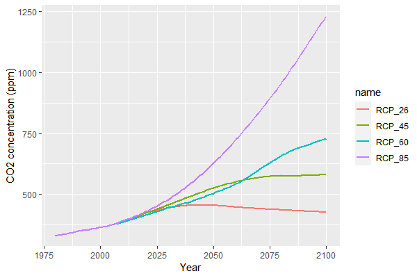

## Format of climate input data


iLand uses climate data on a daily basis. Climate data is stored in a [SQLite database](software-tools.qmd) with a fixed naming convention. The location of the climate database as well as additional options are configured in the [project file](project-file.qmd). The CO2 concentration is considered to be constant for the whole simulated landscape and set using the *model.climate.co2concentration* setting.


| **name** | **description** |
| --- | --- |
| year | absolute year (e.g. 2009) |
| month | month of the year. January=1, December=12 |
| day | day of the month. (1..31). February has 29 days in leap years. |
| min_temp | minimum temperature of the day (°Celsius) |
| max_temp | maximum temperature of the day (°Celsius) |
| prec | precipitation of the day (mm) |
| rad | daily sum of global radiation per m² (MJ/m2/day) |
| vpd | average of the vapour pressure deficit of that day (kPa) |


The mean temperature and the mean temperature of the light hours are calculated as follows ( [Floyd and Braddock, 1984](http://dx.doi.org/10.1016/0168-1923(84)90081-9:), Landsberg, 1986):


$$
t_{day} = 0.212\left ( t_{max}-t_{mean} \right )+t_{mean}
$$


$$
t_{mean}=\frac{t_{min}+t_{max}}{2}
$$


### Older format (< v0.7)


The following table gives an overview of the old format without maximum temperature (used until version 0.7 but can still be used):


| **name** | **description** |
| --- | --- |
| year | absolute year (e.g. 2009) |
| month | month of the year. January=1, December=12 |
| day | day of the month. (1..31). February has 29 days in leap years. |
| temp | average temperature of the light hours of the day (°Celsius) |
| min_temp | minimum temperature of the day (°Celsius) |
| prec | precipitation of the day (mm) |
| rad | daily sum of global radiation per m² (MJ/m2/day) |
| vpd | average of the vapour pressure deficit of that day (kPa) |


## Using climate data in the simulation


### Spatial pattern


The finest possible spatial grain for climate data is the resource unit, i.e. for 100x100m grid cells. However, different resource units may share the same climate input, thus considerably reducing the amount of climate data that needs to be provided by the user and that needs to be processed by the model. It can be set up as follows:
The *system.database.climate* key refers to a (potentially large) SQLite database that contains (potentially many) database tables. Each database table contains one time series of climate data (daily basis, see above for details). A time series can be used for one or many resource units in the simulation: this is defined by an [#spatially distributed parameters|environment file](simulation-extent.qmd). The environment file contains for each resource unit the *name* of the table with the climate data. iLand detects multiple uses of climate tables and reads the data only once.


### Temporal pattern


By default, iLand used the first year of climate data in the database tables for the first simulation year, the second year in the data for the second simulation year, and so forth. If the climate record is finished, it is rolled over and started again from the beginning. However, this behavior can be modified in various ways.

* starting with a specific year of the climate data: use the *filter* setting to filter out all climate data that should be omitted (e.g. if filter is 'year>1959', then no climate data from the 50s is loaded).
* sample randomly from the available climate data: enable the feature by setting *randomSamplingEnabled* to *true*. This tells iLand to batch-load a number of years (see *batchYears*) and subsequently randomly select from that list of years. The order of sampled years can be either fixed (*randomSamplingList*), or randomly picked by the model (if *randomSamplingList* is empty). In both cases, the same sequence of years is used for the whole landscape. A current limitation is that sampling is limited to the climate data that is loaded "batched".


## CO2 concentrations


There are two ways to simulate changing ambient CO2 concentrations in iLand. One way is to use the [time events](time-events.qmd) mechanism. Here you add a column with the name 'model.climate.co2concentration' to your events file and thus update every year the CO2 value of the model.
The second way is easier to use (but less flexible): you can specify a CO2 concentration pathway with the key 'model.climate.co2pathway' (e.g, 'RCP4.5') and define a start year ('model.climate.co2startYear'). The latter defines which year of the CO2-timeseries corresponds to the first simulated year (e.g., if co2startYear is 1990, then the first simulated year will have the CO2 concentration of 1990 (349.91ppm), and year 10 will use the concentration of 2000). Available values for 'co2pathway' are: 'RCP2.6', 'RCP4.5', 'RCP6.0', 'RCP8.5', and 'No' (if no RCP is used). If the key is empty (or 'No'), then time events mechanism is used. The CO2 values are obtained from https://tntcat.iiasa.ac.at/RcpDb and the time series cover 1980 to 2100. Simulated years after 2100 use the CO2 level of 2100. The image shows the CO2 concentrations:



## Importing data into a climate data base


There are several ways to get data in a SQLite database. One option is to use the [ClimateConverter](object-climateconverter.qmd)-javascript object that is built into iLand. Another option is to use database-management-tools that often have a data import functionality (e.g. Sqliteman).
Yet, a powerful and flexible option is to use R and the R-package RSQLite, which is also very useful for analyzing output data of iLand. Below is an example for importing data into a SQLite climate database that can be used by iLand:


```r
################################################################
### Create tables in the climate database for iLand using R ####
################################################################

# we use the R library RSQLite for all database accesses
# look up the help for the avaiable features.
library(RSQLite)
#

# connect to a existing or create a new database
db.conn <<- dbConnect(RSQLite::SQLite(), dbname="e:/Daten/iLand/projects/AFJZ_experiment/database/new_database.sqlite" )

## set up a data frame of climate data using right columns and units
# see http://iland-model.org/climatedata for the required columns

# here load a test data set:
test.data <- read.delim("e:/Daten/BOKU/CCTame/climate/daily/ID014369.csv",sep=";")
head(test.data)
summary(test.data)

# set up the data frame
iland.climate <- data.frame(year=test.data$year,
                            month=test.data$month,
                            day=test.data$day,
                            min_temp=test.data$tmin,
                            max_temp=test.data$tmax,
                            prec=test.data$prec,
                            rad=test.data$rad,
                            vpd=test.data$vpd)
summary(iland.climate)


### save into the database: ####
## the table name is just an example.
## However, this name is referred to in the project file.
dbWriteTable(db.conn, "climate014369",iland.climate, row.names=F)

# helpful, maybe:
# remove the table again:
dbRemoveTable(db.conn, "climate014369")

## check if it worked:
cmp <- dbReadTable(db.conn, "climate014369")
summary(cmp)
```
