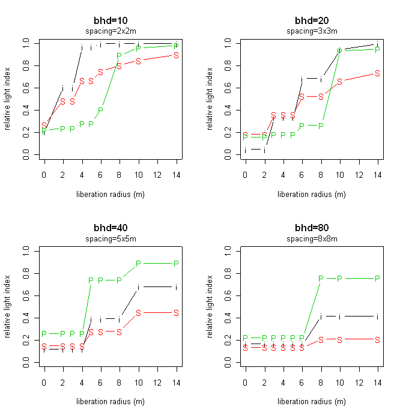
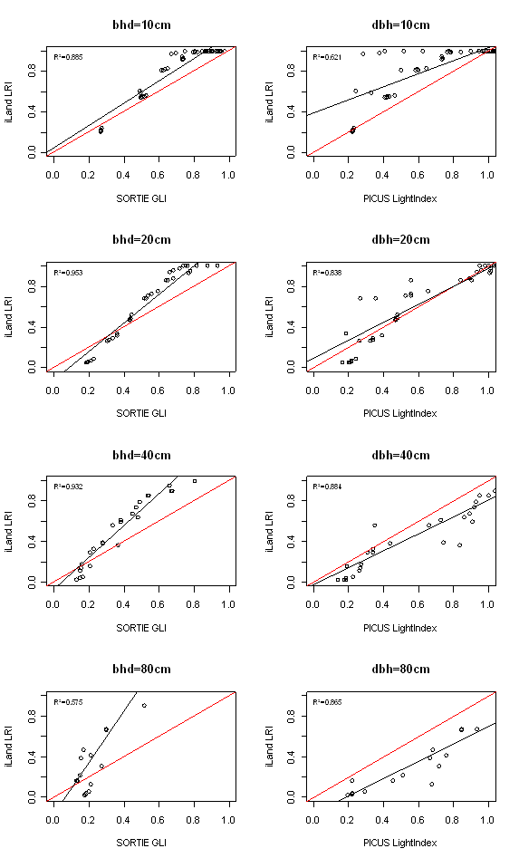
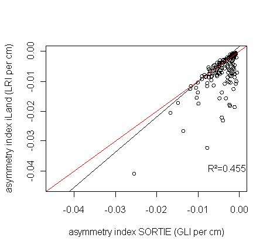
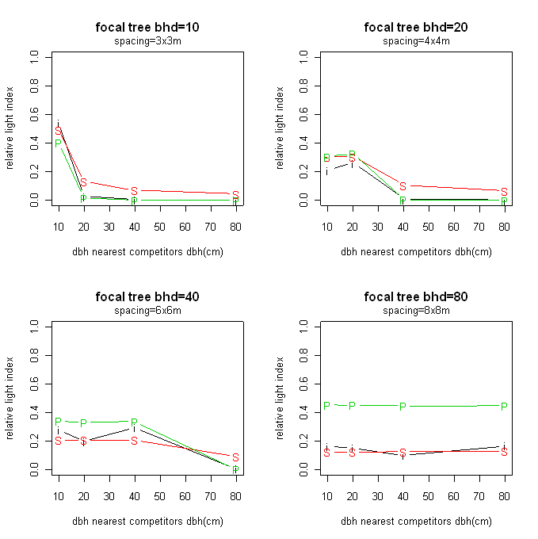
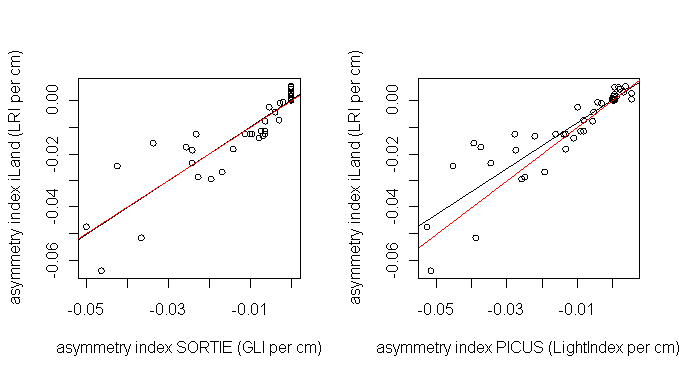

# Generic model testing (model comparison)

## Design

In a first generic test we compared the behavior of iLand *[#An individual tree light resource index to describe competitive status|LRI](competition-for-light.qmd)* to two different approaches of light resource calculation from established forest succession models. We used the *GLI* of SORTIE ([Pacala et al. 1996](http://www.jstor.org/stable/2963479)) and PICUS’ *LightIndex *([Lexer and Hönninger 2001](http://dx.doi.org/10.1016/S0378-1127(00)00386-8), [Seidl et al. 2005](http://treephys.oxfordjournals.org/cgi/reprint/25/7/939)) as reference to generically evaluate model behavior. Although all three indices are used in different contexts in the respective models (*GLI *as explanatory variable in a diameter increment regression in SORTIE, *LightIndex *as modifier to scale diameter and height growth potential in PICUS, *LRI *to indicate the share of light an individual is contributing to resource unit level radiation absorption) they all indicate light availability on a scale from 0 (no light) to 1 (full sunlight) and are strongly linked to biophysical light availability (and not species- and tree-specific light use efficiency, as for instance PICUS' light response), and are thus to a certain degree comparable. The testing experiment focused particularly on the effects of density, configuration and asymmetry. For all tests relevant crown parameters (e.g. crown shape, average crown height) were parametrized for Norway spruce (*Picea abies* L. Karst.).

### Experiment 1: density and configuration

First, to analyze model behavior over different stand densities and evaluate the effect of liberation we compared the models for eight different stand densities (regular tree spacing of 2, 3, 4, 5, 6, 8, 10 and 14m) and the effect of the same eight levels as gap radii around a focal tree (i.e. a liberation of its competitors) in the center of the stand. To factor out asymmetry-effects in this first experiment all trees were assumed identical, with the experiment set up for dbh levels of 10cm, 20cm, 40cm and 80cm (and a constant height to diameter ratio of 80). In total, the analysis compared the three light indices for 450 unique combinations of density and configuration (omitting unrealistically high densities for larger diameters). The objective in this experiment was to directly compare the three different light indices.

### Experiment 2: asymmetry

The second experiment aimed to compare the models’ asymmetry in competition for light. To that end we (i) compared the effect of two individual competitors of different size and (ii) compared the same size differences at the stand level with alternate tree positions of the two tree sizes on a regular grid. For the former we evaluated all possible combinations of trees with dbh 10, 20, 30, 40, 60 and 80cm and again varied the distance to the competitor and the grid spacing over 5 levels (3, 4, 6, 8, and 10m). The stand level asymmetry test was confined to the four dbh-classes described in Experiment 1. As target variable we calculated the asymmetry effect as given by Eq. 1:

$$
i_{a}=\frac{LI_{asym}-LI_{sym}}{dbh_{competitor}-dbh_{focal}}
$$

with *LI *the respective light indices (*GLI*, *LightIndex *and *LRI*) for symmetric (i.e. *dbhcompetitor*=*dbhfocal*) and asymmetric competition and *dbh *their respective diameters at breast height. The asymmetry index *ia* yields negative values for asymmetric conditions, i.e. if competitive effects are larger than size differences, and is standardized to changes in light index per cm *dbh* difference between competitor and focal tree.

## Results

### Experiment 1: density and configuration

Figure 1 shows the response of the light indices to liberation for the four diameter levels and selected stand densities. iLand is generally in good agreement with PICUS and SORTIE, but shows a tendency towards higher light indices at small diameters ([Figure 1](../img/light_evaluation_fig1.png)). This slight bias is confirmed by the analysis over all stand densities and gap radii ([Figure 2](../img/light_evaluation_fig2.png)). For bigger trees iLand falls between the results of PICUS and SORTIE, with a slightly higher response to liberation than the former and a somewhat lower than the latter. Particularly the differences for very big trees highlight the conceptual differences of the two reference models, i.e. the gap model approach of PICUS, strongly driven by horizontal shading vs. the simplified ray tracing of SORTIE. The overall correspondence of the iLand lightregime to the other two models was good to satisfactorily, with R2 of 0.885 and 0.695 for SORTIE and PICUS respectively (corresponding model efficiencies were 0.808 and 0.644). Average model bias was small (<0.001) and not significant for both comparisons (RMSE 0.121 and 0.186 for the comparison to SORTIE and PICUS, respectively). Overall, we found simulated sensitivities to density and liberation from competitors in iLand to compare well to results of PICUS and SORTIE.

**Figure 1: The effect of size, density and liberation on modeled light index. i=iLand, P=PICUS, S=SORTIE**

**Figure 2: Results of Experiment 1 stratified by diameter. Left column: iLand vs. SORTIE, right column: iLand vs. PICUS. red=1:1, black: linear fit**

### Experiment 2: asymmetry

Asymmetry is an important trait of tree competition for light resources and was thus explicitly evaluated in Experiment 2. Compared for two isolated individuals, i.e. a competitor and focal individual, iLand compared reasonably well to SORTIE ([Figure 3](../img/light_evaluation_fig3.png)), with a somewhat higher asymmetry index particularly at close range (i.e. short distance between the two competing individuals). Due to limitations imposed by the PICUS gap structure this comparison was conducted for SORTIE only.

**Figure 3: The asymmetry in competition for light (*ia*, Eq. 1) of two individuals over an array of tree sizes, distances and directions in iLand and SORTIE. red=1:1, black: linear fit**

At stand level we compared the effect of different sizes of a focal trees' nearest neighbors in simulating light indices for a regular, alternating grid of two tree sizes. [Figure 4](../img/light_evaluation_fig4.png) shows examples of this experiment for different focal trees and densities. Whereas bigger and taller nearest neighbors have a strong effect on small individuals (e.g., dbh=10cm) the light resources of big individuals dominating a stand are only very slightly influenced by the size of their neighbors.

**Figure 5: The response of simulated relative light indices to the size of their nearest neighbors for different focal tree dimensions and densities. i=iLand, P=PICUS, S=SORTIE**

Over all combinations of asymmetry and density iLand corresponded well to PICUS and SORTIE, i.e. the simulated response to competitors of different size in iLand was in congruence with the two reference models ([Figure 5](../img/light_evaluation_fig5.png)). Adjusted R2 values were between 0.804 and 0.819 (model efficiencies of 0.823 and 0.808 for the comparisons to SORTIE and PICUS respectively). iLand resulted in unbiased asymmetry indices compared to SORTIE and PICUS, with low RMSE (0.00631 and 0.00656 respectively).

**Figure 5: Comparison of asymmetry indices for stand level competition over a array of densities and asymmetries (cf. Eq.1). red=1:1, black: linear fit**

## Conclusion

We conducted a generic evaluation of the iLand [#An individual tree light resource index to describe competitive status|light resource index](competition-for-light.qmd) by means of a model comparison. iLand *LRI *was found to reproduce the responses of both PICUS and SORTIE to different densities, configurations and size relationships reasonably well, considering the high level of abstraction applied in [iLand](competition-for-light.qmd). The good agreement with both models is particularly noteworthy, as PICUS and SORTIE use strongly different approaches and resolutions to calculate light resources status of individuals. As next steps to this evaluation (i) the approach should be tested in its intended context, i.e. linking [stand level production](growth.qmd) to individual trees, (ii) a sensitivity analysis of assumptions and parameters should be conducted (e.g., crown shape, crown length, crown transmissivity) and (iii) the approach should be tested against empirical data of light availability and competition.

