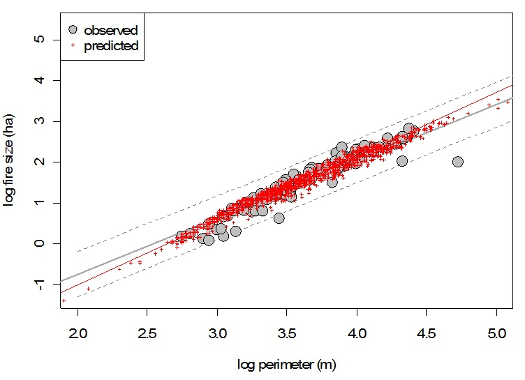
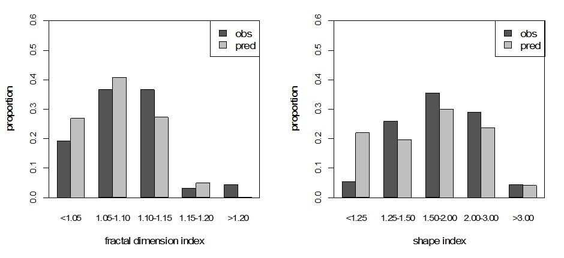
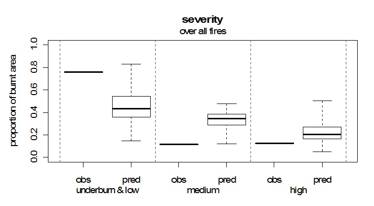
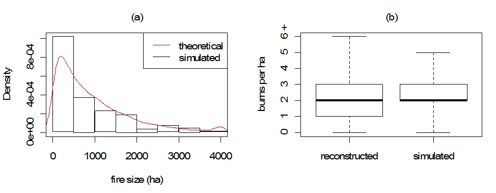

The iLand wildfire module dynamically simulates the ignition, spread, and impact of wildfires on vegetation and C pools as mediated by weather, fuel availability, and topography. A detailed description can be found [on these pages](wildfire.qmd). Here we describe the initial parameterization and evaluation for applications at the [HJ Andrews Experimental Forest (HJA)](http://andrewsforest.oregonstate.edu/). Parameterization and initialization focuses on the period 1500 to 2000, and relies on the climate, soil, and vegetation data compiled by Seidl et al. (in prep.). Topographic information for the HJA watershed was derived from Lidar data and was gridded to 10m resolution.

# Model parametrization

Key model parameters like mean fire-return interval (at 100 m spatial resolution) and the landscape scale fire size distribution are determined from reconstructions of the fire history at HJA (see Teensma 1987, [Weisberg 1998](http://hdl.handle.net/1957/13670), [Tepley 2010](http://hdl.handle.net/1957/18113), Seidl et al., in prep.). To parameterize the extinction probability, i.e., a crucial parameter for the actual shape and size of simulated fires in the cellular automaton fire spread routine of iLand (see [Wimberly 2002](http://dx.doi.org/10.1139/X02-054)), a parameterization experiment was designed using fire history data as reference.
In this experiment, we started fires with random ignition locations within the reconstructed perimeter of burnt patches. We drew maximum patch size for every ignition from the historically observed (i.e., reconstructed) distribution, and randomly assumed wind direction and wind speed (between 10 and 25 m s-1). Using the simulated vegetation and fuel loads in the year prior to the fire we simulated 100 replicates for each of the 13 fire years on record. We iteratively determined extinction probability by comparing metrics of simulated fire shape to those reconstructed for historical fires. The evaluation metrics used were fractal dimension index ([McGarigal et al. 2002](http://www.umass.edu/landeco/research/fragstats/fragstats.html)), shape index ([McGarigal et al. 2002](http://www.umass.edu/landeco/research/fragstats/fragstats.html)), and the relationship between fire size and fire perimeter (see [Wimberly 2002](http://dx.doi.org/10.1139/X02-054)).
Figures 1 and 2 show the observed and predicted fire shapes for an extinction probability of 0.24, the preliminary endpoint of our iterative parameterization procedure. Despite the fact that some deviance between simulated and reconstructed fires is still evident the considerable uncertainties associated with fire history reconstruction render tweaking the model further to exactly reproduce the history data spurious.

**Figure 1:** Fire size over fire perimeter for reconstructed fire patches (grey) and simulated fire patches (red). Solid lines give linear relationships in log-log space, with dashed grey lines the confidence interval of the linear model for observed (i.e., reconstructed) fires.

**Figure 2:** Reconstructed (obs) and simulated (pred) fire shapes for fire patches at the HJA. For description of the metrics see [McGarigal et al. (2002)](http://www.umass.edu/landeco/research/fragstats/fragstats.html).

We also slightly adapted the empirical crown kill function implemented in iLand, originally parameterized for Rocky Mountains ecosystems by [Schumacher et al. (2006)](http://dx.doi.org/10.1007/s10980-005-2165-7), to western Cascades ecosystems in order to reproduce expected and reconstructed fire severity distributions over the landscape (Figure 3). Compared to the fire history reconstruction used here iLand generally simulated fires of higher severity, i.e. with lesser proportion of low severity fires on the landscape. However, the mean simulated proportion of low severity fires (45%) compared well to the findings of [Weisberg (1998)](http://hdl.handle.net/1957/13670), who estimated it to be 42% for western Cascades landscapes based on tree ring analyses. Also, [Agee (1993)](http://tinyurl.com/73usrh4) reports approximately 16% high severity patches in mountain forests of the southern Oregon Cascades, which is close to the simulated 22% (mean over all simulated fires in the parameterization experiment). Generally, the model is well able to reproduce the mixed severity nature of these forest types, and considering that Douglas-fir - Western Hemlock forest types have the highest share of high severity patches among mixed-severity types ([Perry et al. 2011](http://dx.doi.org/10.1016/j.foreco.2011.05.004)) we consider the simulated severity distribution plausible.

**Figure 3:** Simulated (pred) and reconstructed (obs) fire severity at the HJA.

# Model evaluation

To evaluate the full model dynamics (i.e., the interactions between stand dynamics, fuel buildup, fire occurrence, spread, and severity) and assess whether iLand is able to recreate the fire regime of the HJA, we conducted a series of simulation runs from 1500 to 2000. Starting from the last landscape scale burn these runs utilized the above described empirical distributions and estimated parameters. To evaluate the model we compared the simulated fire size distribution, the mean fire return interval as well as fire severity classes over the landscape. Since the iLand fire module is a stochastic model, we conducted ten replicates (note that a higher number of replicates would of course be desirable, and that the preliminary results shown here are a compromise between precision and computing time).
The simulated mean fire size over all fires and replicates (778 ha) was somewhat lower than the reconstructed mean fire size for the HJA of 952 ha. However, the strongly skewed fire size distribution resulting from the simulations corresponded well with the expectations in this regard (Figure 4). Simulated mean fire return intervals, calculated for every hectare of the landscape, matched well with fire history reconstructions (248 and 262 years for simulated and observed mean fire return interval, respectively). The fact that iLand in this initial runs is not capturing the observed extremes (both with regard to maximum fire sizes as well as with regard to a small area of the landscape being burned with high frequency) is likely a result of the small number of iterations used to produce these results. Furthermore, with regard to a moderate underestimation of areas being burned infrequently or not at all (Figure 4b), it has to be noted that the current runs do not implement fire spread restrictions for riparian areas, i.e. currently simulated fires spread unrestricted into riparian zones. This could, however, be improved in future runs by making use of the land-type modifier implemented in the iLand fire spread algorithm along the lines of [Wimberley and Kennedy (2008)](http://dx.doi.org/10.1016/j.foreco.2007.06.044).

**Figure 4:** (a) Simulated versus expected fire sizes (assuming a min-max constrained negative exponential fire size distribution). (b) Frequency of fires per hectare for the 6364 ha HJA landscape from fire history reconstructions and iLand simulations. Simulation results are the derived from ten replicates of a 500 year simulation series.

::: {.callout-note title="citation"}
[Seidl, R., Rammer, W., Spies, T.A. 2014](http://dx.doi.org/10.1890/14-0255.1). Disturbance legacies increase the resilience of forest ecosystem structure, composition, and functioning. Ecol. Appl., in press. http://dx.doi.org/10.1890/14-0255.1
:::

