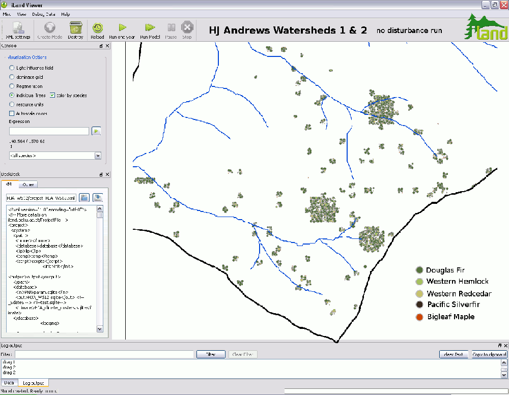

# an individual-based forest landscape and disturbance model

**iLand**, the <u>**i**</u>ndividual-based forest <u>**lan**</u>dscape and <u>**d**</u>isturbance model, is developed in a collaborative effort by a <u>[team of scientists](team.qmd)</u> in Austria and the US Pacific Northwest to advance our ability to simulate <u>[complexity](ecological-complexity.qmd)</u> in forest ecosystems. Motivated by the expected **climatic changes** and possible no-analog disturbance regimes, both affecting a variety of (interacting) ecosystem processes at varying scales, the multi-scale model iLand aims at enhancing analytic capacities in support of **sustainable forest management** and climate impacts research. iLand integrates aspects of **individual-based modeling** and **physiological principles** with a focus on the **landscape scale**, simulating forest dynamics as an emerging property of key ecosystem mechanisms and interactions (e.g., between individual trees, the biosphere and the environment, disturbances). The core development of iLand is funded by a [Marie Curie Scholarship](http://cordis.europa.eu/fp7/people/home_en.html) within the [7th Framework Program](http://cordis.europa.eu/fp7/home_en.html) of the European Commission. The iLand software is open source and freely available for non-commercial applications in science and research.

## explore iLand

 

* hear about [new developments](http://iland-model.org/blog2) and [technical blips](http://iland-model.org/blog1) from the 'engine room'
* find out more <u>[about the project](project-abstract.qmd)</u> and [iLands niche in the landscape of existing forest ecosystem models](iland-model-complexity-and-its-niche-in-the-landscape-of-models.qmd)
* get to know the <u>[iLand team](team.qmd)</u>
* browse <u>[iLand-related publications](iland-publications.qmd)</u>
* view the [model documentation](iland-model-documentation.qmd) pages
* download the [model software and source code](iland-software-and-source-code.qmd)
* [contact and credits](contact-information.qmd)

## individual-based modeling at the watershed scale

The animation below shows a 500 year iLand simulation for a 172 ha watershed in the [HJ Andrews experimental forest](http://andrewsforest.oregonstate.edu/), central western Cascades, Oregon. More information about this particular simulation can be found [here](http://iland-model.org/blog2).

  
