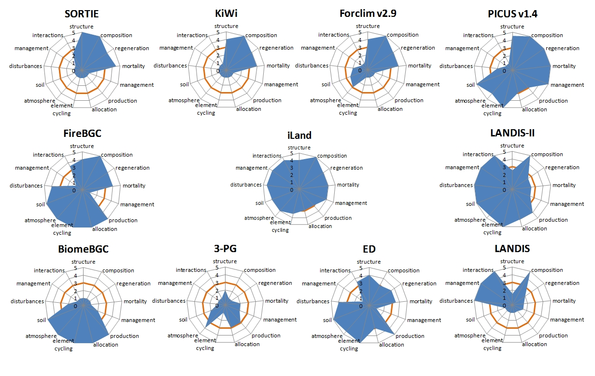
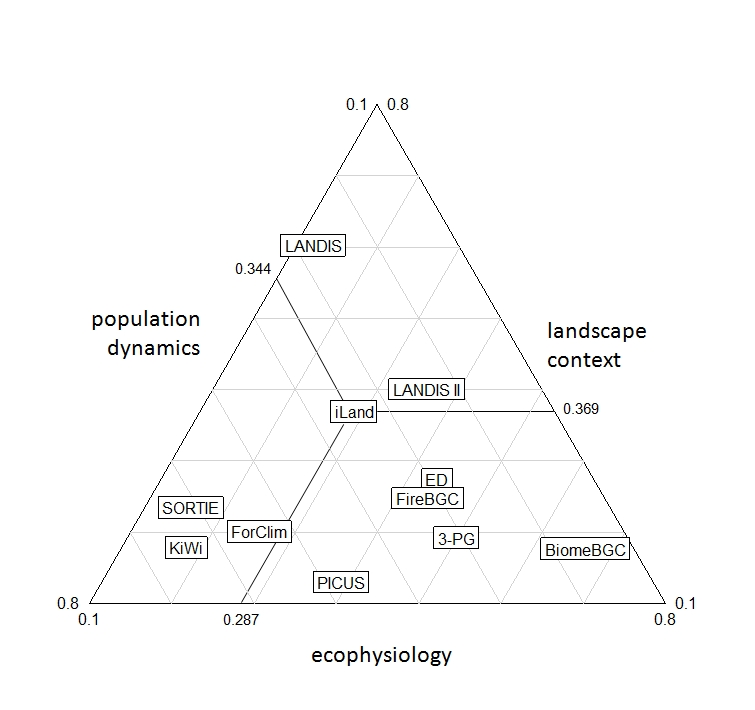

Determining the level of complexity is an important step in designing a model. A good model is a parsimonious one- it should contain all the complexity needed to address its specific aims but not more, an axiom also known as [Occam’s razor](http://en.wikipedia.org/wiki/Occam’s_Razor) (see for instance the discussion in [Kimmins et al. 2008](http://dx.doi.org/10.1016/j.foreco.2008.03.011)). Evidently, the process of simplifying reality in building a model, i.e. the determination of the appropriate level of complexity, is context-specific. Consequently there is no globally agreeable level of complexity and no “one size fits all” model for the variety of questions and applications that models can help to address.

The required level of model complexity for specific tasks has recently been quantitatively investigated by several studies, analyzing model behavior with different submodels of varying complexity (e.g.,[Astrup et al. 2008](http://dx.doi.org/10.1016/j.foreco.2008.07.016), [Kimmins et al. 2008](http://dx.doi.org/10.1016/j.foreco.2008.03.011)). Here the aim is to put the question of model complexity at the very beginning of model development, serving as a frame for the structural design of the model to be developed in the current study ([iLand](iland.qmd)). Choosing a relative definition of model complexity, i.e. relative to existing modeling approaches, this exercise is also designed to help defining the niche of iLand in the "landscape of established models" and highlight related approaches of relevance for iLand model development.

Acknowledging the importance of context for the determination of model complexity the starting point for this analysis is the projects intended aim and application. iLand should serve the analysis of forest dynamics under changing climate and disturbance regimes and project the interactions between climate (change), disturbance regimes and sustainable forest management. The framework aims at ecological generality, i.e. a general model structure applicable for a variety of temperate forest ecosystems, hence purely empirical models are excluded from the review of the current report.

## Methods and material

### Dimensions & Indicators {#dimensions-and-indicators}

The landscape of models, i.e. the analysis space for model complexity in this exercise, was defined by three [dimensions of complexity](http://dx.doi.org/10.1016/j.ecocom.2003.09.001), i.e. structural (i.e. population dynamics), functional (i.e. ecophysiology) and spatial (i.e. landscape context) complexity. Each dimension was operationally defined by a set of indicators, representing major ecosystem processes and traits (see Table 1). Model complexity was assessed for every indicator using an ordinal scoring relative to the selected reference models ([see below](#reference-models)), where the most complex representation of the process among the reference models received the highest (5) and the most simple representation the lowest score (1). Aggregation of indicators within the three dimensions was performed by a mean operator.

**Table 1: Indicator definition for the three assessment dimensions {#table-1}**

| ***dimension*** | ***indicator*** | ***description*** |
| --- | --- | --- |
| structural complexity (population dynamics) | structure | structural representation of the ecosystem, its constituents and their interactions; includes the approach to model competition |
|  | composition | compositional representation of the ecosystem (e.g., species) |
|  | regeneration | resolution in modeling the processes related to regeneration of trees |
|  | mortality | approach to model the processes related to tree death (excluding disturbance- and management-related mortality causes) |
|  | management | representation and flexibility in individual- to stand level management |
| functional complexity (ecophysiology) | primary production | representation of gross primary production and respiration in the model |
|  | allocation | processes structuring ecosystem compartments, i.e. allocation of photosynthetic products to tree organs |
|  | element cycling | element cycles modeled explicitly (e.g., C, N, H2O) |
|  | atmospheric processes | which atmosphere-related factors (e.g., climate parameters) are included and how are they represented |
|  | belowground processes | detail and process resolution of soil-bound processes in the model |
| spatial complexity (landscape context) | disturbances | account of natural disturbances in the model |
|  | management | representation and flexibility in management aspects at the landscape level (e.g., patterns, scheduling) |
|  | interactions | spatio-temporal interactions at the landscape scale (e.g., disturbance interactions, seed dispersal) |

### Reference Models {#reference-models}

Since complexity is a trait linked to the context investigated (e.g. low complexity might mean different things in modeling global vegetation distribution and modeling chloroplast activity at the leaf level) a relative definition of complexity was chosen for this analysis. I selected a set of ten different models from the general domain of application in focus here. These reference models include detailed individual-based competition models and gap models (SORTIE, [Pacala et al. 1996](http://www.jstor.org/stable/2963479); KiWi, [Berger and Hildebrandt 2000](http://dx.doi.org/10.1016/S0304-3800(00); ForClim v2.9.3, [Bugmann and Solomon 2000](http://www.jstor.org/stable/2640989), [Risch et al. 2005](http://dx.doi.org/10.1016/j.ecolmodel.2004.06.029)), process-based models of different level of aggregation (3-PG, [Landsberg and Waring 1997](http://dx.doi.org/10.1016/S0378-1127(97); BiomeBGC, Running and Coughlan 1988, [Thornton et al. 2002](http://dx.doi.org/10.1016/S0168-1923(02)) as well as models simulating forest dynamics at larger scales (LANDIS, [He and Mladenoff 1999](http://www.jstor.org/stable/176981), [Mladenoff 2004](http://dx.doi.org/10.1016/j.ecolmodel.2004.03.016); ED, [Moorcroft et al. 2001](http://www.jstor.org/stable/3100036)). I also included models integrating different approaches in modular, hierarchical and hybrid model approaches (FireBGC, [Keane et al. 1996](http://treephys.oxfordjournals.org/cgi/content/abstract/16/3/319), [1999](http://dx.doi.org/10.1023/A:1008011916649); LANDIS-II, [Scheller et al. 2007](http://dx.doi.org/10.1016/j.ecolmodel.2006.10.009), [Scheller and Mladenoff 2004](http://dx.doi.org/10.1016/j.ecolmodel.2004.01.022); PICUS v1.4, [Seidl et al. 2005](http://treephys.oxfordjournals.org/cgi/content/abstract/25/7/939), [Lexer and Hoenninger 2001](http://dx.doi.org/10.1016/S0378-1127(00)). This selection of reference models intends to span a variety of widely applied modeling approaches. It has to be noted, however, that it is not destined to be an exhaustive review of forest ecosystem models. Furthermore, where different model versions and modifications exist one indicative representation was selected (see references above), with the exception of LANDIS. LANDIS is a highly flexible modeling platform and two different realizations of the model, spanning a wide complexity gradient, were included in the set of references models: The original LANDIS version ([cf. He and Mladenoff 1999](http://www.jstor.org/stable/176981), [Mladenoff 2004](http://dx.doi.org/10.1016/j.ecolmodel.2004.03.016)), representing a widely applied example of a classical landscape model and a LANDIS-II rendering employing extensions using PnET physiology and Century soil processes ([R.M. Scheller](http://www.consbio.org/about/staff-board-1/Robert-M.-Scheller-Ph.D), personal communication). It has to be acknowledged that the relative complexity scoring is essentially an expert assessment, i.e. entails a certain degree of fuzziness and is no accurate quantitative metric. Thus to facilitate transparency in this assessment a descriptive account of the complexity assessment for the selected models is given below with regard to aspects of structural complexity (see Tables 2-6 below), functional complexity (see Tables 7-11 below), and spatial complexity (see Tables 12-14 below) in addition to the relative scoring.

### Structural Complexity (Population Dynamics) {#structural-complexity}

**Table 2: Population dynamics - structure**

| ***model*** | ***process description*** | ***relative complexity scoring*** |
| --- | --- | --- |
| SORTIE | spatially explicit (coordinates), individual-based, 3D structure (crown geometry) and individual competition for light, GLI (seasonally aggregated measure of photosynthetically active available radiation at the top of every crown) | 5 |
| KiWi | spatially explicit (coordinates), field of neighborhood defines individuals competitve influence on others, additive competitive influence for an individual is averaged over zone of influence | 4 |
| ForClim | gap model structure, individual-based, within patch horizontally non-explicit, beer-lambert law for light availability of trees on patch | 4 |
| 3-PG | mean tree approach | 2 |
| BiomeBGC | big leaf approach | 1 |
| LANDIS | species-age cohorts | 1.5 |
| ED | ecosystem demography approach, 15x15m patch structure of independent patches, within patch horizontally non-explicit, size- and age structured approximation of the first moment of the stochastic gap model with partial differential equations | 4 |
| FireBGC | individual tree succession model, individual trees simulated at plot level, competition at stand level, biogeochemistry at stand level | 4 |
| LANDIS-II | species-age-biomass cohorts, competition via biomass-related growing space estimation | 2.5 |
| PICUS | 3D gap model, individual-based, explicit horizontal and vertical spatial interactions between patches with regard to light availability (5m crown cells), homogeneous foliage biomass distribution within tree crown | 4.5 |

**Table 3: Population dynamics - composition**

| ***model*** | ***process description*** | ***relative complexity scoring*** |
| --- | --- | --- |
| SORTIE | multiple tree species, parameterized for central eastern US, Canada, other temperate, boreal and tropical forest regions | 5 |
| KiWi | multiple tree species, parameterized for Mangrove ecosystems | 5 |
| ForClim | multiple tree species, parameterized for central Europe, PNW | 5 |
| 3-PG | evenaged, monospecies stands, parameterized for different parts of the world | 1 |
| BiomeBGC | not modeled explicitly; species parameters for different biomes | 1 |
| LANDIS | multiple tree species, parameterized for central eastern US, Canada, other temperate and boreal forest regions | 5 |
| ED | plant-functional types, different temperate and tropical ecosystems | 3 |
| FireBGC | multiple tree species, parameterized for western US | 5 |
| LANDIS II | multiple tree species, parameterized for central eastern US, Canada, other temperate and boreal forest regions | 5 |
| PICUS | multiple tree species, parameterized for central Europe | 5 |

**Table 4: Population dynamics - regeneration**

| ***model*** | ***process description*** | ***relative complexity scoring*** |
| --- | --- | --- |
| SORTIE | seedling establishment probability based on distance from maternal tree | 4 |
| KiWi | depending on the competitive strength (field of neighborhood) from other individuals | 4 |
| ForClim | recruitment (dbh=1.27), depending on light availability on the forest floor, browsing and winter minimum temperature | 4 |
| 3-PG | not modelled | 1 |
| BiomeBGC | not modelled explicitly | 1 |
| LANDIS | spatially explicit dispersal, establishment rate based on land-type related probability | 2 |
| ED | random dispersal, recruitment model | 3.5 |
| FireBGC | spatially explicit dispersal, recruitment model with temperature and drought index as thresholds, depending on seed availability | 4 |
| LANDIS II | spatially explicit dispersal, establishment rate based on light availability (biomass), establishment probability (land type) | 2.5 |
| PICUS | seed production and distribution, germination, cohort regeneration model, recruitment into the individual-based model structure, influenced by light level on forest floor as well as climate and soil factors | 5 |

**Table 5: Population dynamics - mortality**

| ***model*** | ***process description*** | ***relative complexity scoring*** |
| --- | --- | --- |
| SORTIE | growth related (function of growth rate of the last 5 years), random component | 4.5 |
| KiWi | stress-realted mortality based on diameter increment | 4 |
| ForClim | age- and stress-related mortality components | 4 |
| 3-PG | -3/2 power law | 2 |
| BiomeBGC | not modelled explicitly | 1 |
| LANDIS | age effect | 1.5 |
| ED | age- and carbon balance driven components | 3.5 |
| FireBGC | random and stress (diameter increment) related components | 4 |
| LANDIS II | competition-related crowding effect, age effect | 2.5 |
| PICUS | age- and stress-related mortality components, age-related mortality variable with site quality | 5 |

**Table 6: Population dynamics - management**

| ***model*** | ***process description*** | ***relative complexity scoring*** |
| --- | --- | --- |
| SORTIE | no management | 1 |
| KiWi | no management | 1 |
| ForClim | no management | 1 |
| 3-PG | reduction of stem number / leaf area | 2 |
| BiomeBGC | removal of biomass from ecosystem pools | 2 |
| LANDIS | species-age cohort | 1.5 |
| ED | no management | 1 |
| FireBGC | no management | 1 |
| LANDIS II | species-age-biomass cohort, bottom up or top down removal of cohorts | 2.5 |
| PICUS | prescriptive on individual tree level, spatially explicit, implementation of adaptive management through script engine | 5 |

### Functional Complexity (Ecophysiology) {#functional-complexity}

**Table 7: Ecophysiology – primary production**

| ***model*** | ***process description*** | ***relative complexity scoring*** |
| --- | --- | --- |
| SORTIE | empirical growth equation for diameter increment based on individual diameter and light avialability | 1 |
| KiWi | empirical maximum diameter growth equation reduced by competition and enviornmental effects | 1 |
| ForClim | empirical maximum diameter increment rate reduced by environmental modifiers | 1 |
| 3-PG | process-based radiation use efficiency approach at stand level, constant respiration fraction, reduction of potential production by environmental modifiers | 3 |
| BiomeBGC | Farquhar model, autotrophic respiration (maintanance and growth components) | 5 |
| LANDIS | not modelled | 1 |
| ED | Farquhar model, autotrophic respiration proportional to maximum ratio of carboxylation | 5 |
| FireBGC | Farquhar model, autotrophic respiration (maintanance and growth components) | 5 |
| LANDIS II | process-based (PnET-II, currently external, algorithms being implemented into LANDIS II): leaf level photosynthesis, growth and maintanance respiration | 4 |
| PICUS | process-based radiation use efficiency approach at stand level, constant respiration fraction, reduction of potential production by environmental modifiers | 3 |

**Table 8: Ecophysiology – allocation**

| ***model*** | ***process description*** | ***relative complexity scoring*** |
| --- | --- | --- |
| SORTIE | empirical growth equation for diameter increment based on individual diameter and light avialability | 1 |
| KiWi | empirical maximum diameter growth equation reduced by cometition effect and salinity | 1 |
| ForClim | empirical maximum diameter increment rate reduced by environmental modifiers | 1 |
| 3-PG | functional balance, parameterized with empirical allometric equations | 3 |
| BiomeBGC | dynamic allocation, balancing constant C:N stoichiometry of pools | 5 |
| LANDIS | not modelled | 1 |
| ED | functional balance, parameterized with empirical allometric equations, pipe model theory for sapwood | 3 |
| FireBGC | dynamic allocation, balancing constant C:N stoichiometry of pools | 5 |
| LANDIS II | hierachical, buds-foliage, fine roots, plant reserves pool, wood (PnET) | 4 |
| PICUS | functional balance, parameterized with empirical allometric equations | 3 |

**Table 9: Ecophysiology – element cycling**

| ***model*** | ***process description*** | ***relative complexity scoring*** |
| --- | --- | --- |
| SORTIE | aboveground biomass | 1 |
| KiWi | aboveground biomass | 1 |
| ForClim | aboveground biomass | 1 |
| 3-PG | aboveground biomass | 1 |
| BiomeBGC | closed C, N, water and energy cycles | 5 |
| LANDIS | not modelled | 1 |
| ED | closed C, N and water cycle | 5 |
| FireBGC | closed C, N, and water cycles | 5 |
| LANDIS II | closed C, N and water cycles (with integrated PnET and Century extension) | 5 |
| PICUS | closed C, N, and water cycles | 5 |

**Table 10: Ecophysiology – atmospheric processes**

| ***model*** | ***process description*** | ***relative complexity scoring*** |
| --- | --- | --- |
| SORTIE | light only | 1 |
| KiWi | light only | 1 |
| ForClim | summer temperature (degree day index), drought (transpiration deficit) | 3 |
| 3-PG | temperature, frost, vapor pressure deficit, radiation | 4 |
| BiomeBGC | temperature, precipitation, VPD, PAR, CO2, O3 | 5 |
| LANDIS | not directly modelled | 1 |
| ED | temperature, VPD, PAR | 4.5 |
| FireBGC | temperature, precipitation, PAR, CO2, O3 | 5 |
| LANDIS II | PnET-II: temperature, PAR, VPD | 4.5 |
| PICUS | temperature (both daily GPP optimum and annual GDD), frost, vapor pressure deficit, soil moisture (actual to potential transpiration), PAR | 4 |

**Table 11: Ecophysiology – belowground processes**

| ***model*** | ***process description*** | ***relative complexity scoring*** |
| --- | --- | --- |
| SORTIE | none | 1 |
| KiWi | none | 1 |
| ForClim | nitrogen availability, soil moisture | 2.5 |
| 3-PG | aggregated fertility rating, soil moisture | 2 |
| BiomeBGC | dynamic soil litter and SOM pools | 5 |
| LANDIS | not directly modelled | 1 |
| ED | dynamic soil model of C and N cycling (Century), one layer bucket model for soil water | 5 |
| FireBGC | dynamic soil litter and SOM pools | 5 |
| LANDIS II | dynamic soil model of C and N cycling (Century extension), one layer bucket model for soil water | 5 |
| PICUS | dynamic soil model of C and N cycling, one layer bucket model for soil water, response function for pH value | 5 |

### Spatial Complexity (Landscape Context) {#spatial-complexity}

**Table 12: Landscape context – disturbances**

| ***model*** | ***description*** | ***relative complexity scoring*** |
| --- | --- | --- |
| SORTIE | none (potentially included in later versions) | 1 |
| KiWi | none | 1 |
| ForClim | browsing as reduction of recruitment potential; stand level | 2 |
| 3-PG | none | 1 |
| BiomeBGC | general, represented as loss from biomass pools | 2 |
| LANDIS | wind, fire, insects; spatially explicitly; feedbacks on species - age cohorts | 5 |
| ED | fire; spatially explicit | 4 |
| FireBGC | fire; spatially explicit | 4 |
| LANDIS II | wind, fire, insects; spatially explicitly; feedbacks on species - age - biomass cohorts | 5 |
| PICUS | bark beetles (stand level), feedback on stand structure | 2 |

**Table 13: Landscape context – management**

| ***model*** | ***description*** | ***relative complexity scoring*** |
| --- | --- | --- |
| SORTIE | no management | 1 |
| KiWi | no management | 1 |
| ForClim | no management | 1 |
| 3-PG | no landscape scheduling | 1 |
| BiomeBGC | no landscape scheduling | 1 |
| LANDIS | spatial and temporal flexibility in landscape scale management | 5 |
| ED | no management | 1 |
| FireBGC | no landscape scheduling | 1 |
| LANDIS II | spatial and temporal flexibility in landscape scale management | 5 |
| PICUS | no landscape scheduling | 1 |

**Table 14: Landscape context – interactions**

| ***model*** | ***description*** | ***relative complexity scoring*** |
| --- | --- | --- |
| SORTIE | dispersal (if applied above stand level) | 2.5 |
| KiWi | none | 1 |
| ForClim | no spatial interactions between patches | 1 |
| 3-PG | no landscape level interactions | 1 |
| BiomeBGC | no landscape level interactions | 1 |
| LANDIS | spatially explicit seed dispersal and disturbance processes; interactions between disturbances | 5 |
| ED | spatial fire spread between gaps (spatial seed dispersal possible) | 3.5 |
| FireBGC | spatially explicit seed dispersal, fire spread | 3.5 |
| LANDIS II | spatially explicit seed dispersal and disturbance processes; interactions between disturbances | 5 |
| PICUS | no landscape level interactions | 1 |

## Results

### iLand Model Complexity {#iland-model-complexity}

The main rationale in designing iLand is that addressing climate change, natural disturbances and management in simulations of forest dynamics requires consideration of all three dimensions of complexity described in [Table 1](#dimensions-and-indicators).
Processes of population dynamics (i.e. structural complexity) are at the core of forest dynamics- forest structure and composition are essentially mediators between the factors climate, disturbances and management- and need thus explicit consideration in iLand. Furthermore, studying effects of climate change requires a realistic consideration of regeneration processes (e.g., migration) and mortality (e.g., as response to climatic extremes). Climate sensitivity is also determining the need for a raised level of functional complexity (i.e. ecophysiology), increasing model robustness in applications under unique environmental conditions. Element cycling and soil processes are, beyond their relevance for ecosystem functioning, increasingly important for questions of ecosystem management, e.g. with regard to the climate change mitigation potential of forest ecosystems. Spatial complexity at the landscape scale is both important with regard to management, where spatial aspects at this scale are increasingly recognized, as well as in relation to natural disturbances. For large parts of the latter particularly strong climate sensitivities are expected, underlining their relevance in studies of climate change impacts and adaptation.

This analysis leads to the conclusion that all three dimensions need a considerable level of complexity in order to study climate – disturbance – management interactions. However, it is also acknowledged that trade-offs between the achievable degrees of complexity remain ([Mladenoff 2004](http://dx.doi.org/10.1016/j.ecolmodel.2004.03.016)). The approach taken in iLand aims at the level of complexity needed to acknowledge ecosystem behavior at the landscape level as complex adaptive system (e.g. with gap dynamics an emerging property of the system, see [Grimm and Railsback 2005](http://books.google.com/books?id=12MvUbMeog8C&printsec=frontcover&dq=Grimm+and+Railsback+2005)), to address ecosystem complexities explicitly (cf. [Kimmins et al. 2008](http://dx.doi.org/10.1016/j.foreco.2008.03.011)) in including processes relevant to its dynamics, while taking aggregated and simplified approaches where possible without limiting the overall analysis capacity towards the models intended application (cf. [Mladenoff 2004](http://dx.doi.org/10.1016/j.ecolmodel.2004.03.016)). iLand aims at a balanced representation of relevant ecosystem dimensions, addressing- at the approximate same level of complexity- the structural, functional and spatial dimensions of forest ecosystems. The modeling approach is thus a fusion of different traditional schools and approaches in forest ecosystem modeling at an intermediate to high level of complexity, while accepting a considerable simplification relative to detailed process-specific models. Focus and novelty in modeling will thus particularly lie on the interactions of processes and dimensions, i.e. the feedbacks between population dynamics, ecophysiology and landscape level processes, as a means to analyze the interactions between climate – disturbances and forest management.

The representation of main processes in iLand and its scoring in the framework of relative model complexity are given in Table 15 (cf. Tables 2-6, Tables 7-11 and Tables 12-14 above for reference models).

**Table 15: Relative levels of complexity in iLand {#table-15}**

| ***dimension*** | ***indicator*** | ***description*** | ***scoring*** |
| --- | --- | --- | --- |
| population dynamics | structure | spatially explicit (coordinates), pattern-oriented ecological field defines an individuals competitve influence on others | 4 |
|  | composition | multiple tree species, parameterized for PNW & central Europe | 5 |
|  | regeneration | seed distribution, germination, recruitment into the individual-based model structure, influenced by local light availability, climate and soil factors | 4 |
|  | mortality | age- and stress-related mortality components | 4 |
|  | management | stand to individual level, spatially explicit, implementation of adaptive management through scripting engine | 4 |
| ecophysiology | primary production | process-based radiation use efficiency approach, stand level radiation interception, individual level competition and physiology, reduction of potential production by environmental modifiers | 3 |
|  | allocation | functional balance, parameterized with empirical allometric equations | 3 |
|  | element cycling | closed C, and water cycles (N tbd) | 3.5 |
|  | atmospheric processes | temperature, frost, vapor pressure deficit, soil moisture, PAR | 4 |
|  | belowground processes | dynamic soil model of C cycling,  static water holding capacity, nutrient availability (N tbd) | 4 |
| landscape context | disturbances | wind, fire, insects | 4.5 |
|  | management | spatial and temporal flexibility in landscape scale management (spatial extent watersheds to medium landscapes) | 4.5 |
|  | interactions | spatially explict seed dispersal, disturbance processes (spatial extent watersheds to medium landscapes) | 4.5 |

### iLand's Niche at the Indicator Level {#indicator-level}

Figure 1 illustrates the level of complexity for the selected indicators in iLand and the reference models chosen for this study. This analysis of complexity naturally reflects the respective domains of application of the individual reference models, i.e. ranging from the analysis of individual-based population dynamics (SORTIE, KiWi) to ecophysiological processes (BiomeBGC) and landscape dynamics (LANDIS). Figure 1 also documents the abilities of modular or hybrid approaches (i.e. LANDIS-II, FireBGC, PICUS in this analysis) to cover a greater number of processes with a considerable level of complexity than model approaches specialized on a particular dimension. This approach is to be further extended in iLand, using a fusion of different concepts to achieve a satisfactory level of complexity for all relevant process indicators and an overall balanced representation of model complexity between the dimensions.

{width=700}

### iLand's Niche at the Modeling Dimensions Level {#modeling-dimensions-level}

Aggregating the individual indicator scores to the three respective dimensions allows a 3D illustration of the models niches in the landscape of models. Figure 2 gives a 3D account of this approximate niche space, and Figure 3 resolves the three dimensions into 2D plots.

{width=400}

{width=700}

This analysis shows iLand's intended niche in the intermediate to high complexity range of all three dimensions. Closest reference model neighbors to this niche are LANDIS-II and FireBGC. The balance of complexity between the three dimensions can be displayed in a triangle chart, where the three sides give the relative degree of complexity for each model in the three dimensions (i.e. the respective complexity scoring for the dimension divided by the sum of all complexity scorings per model). A model of perfectly balanced complexity between the three dimensions (0.33 for every axis) would be situated in the center of the triangle. Figure 4 shows that iLand and LANDIS-II are situated close to the center, featuring the best balance between population dynamics, ecophysiology and landscape context of the models analyzed in this exercise.

{width=400}

## Discussion and conclusion

The analysis conducted here highlights the niche of the model under development in the current project and documented its neighbors in the landscape of models. It showed that a holistic ecosystem approach with regard to the indicators and dimensions of relevance to the overall objectives of the project has been scarcely taken in forest ecosystem modeling until now. The analysis, however, also indicates promising existing approaches in addressing the challenges in modeling resulting from such an approach. Particularly the models LANDIS-II and FireBGC give interesting reference points for the [iLand](iland.qmd) approach. Further noteworthy models and frameworks in this regard, not included in the current analysis, include LandClim ([Schumacher et al. 2004](http://dx.doi.org/10.1016/j.ecolmodel.2003.12.055)), TreeMig ([Lischke et al. 2006](http://dx.doi.org/10.1016/j.ecolmodel.2005.11.046)), SeibDVM ([Sato et al. 2007](http://dx.doi.org/10.1016/j.ecolmodel.2006.09.006)), and SELES ([Fall and Fall 2001](http://dx.doi.org/10.1016/S0304-3800(01)). Based on this analysis of complexity iLand is a relevant addition to the emerging set of forest ecosystem models for landscape level analysis of climate - disturbance - management interactions.
