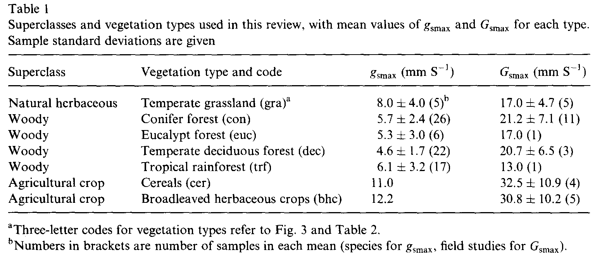
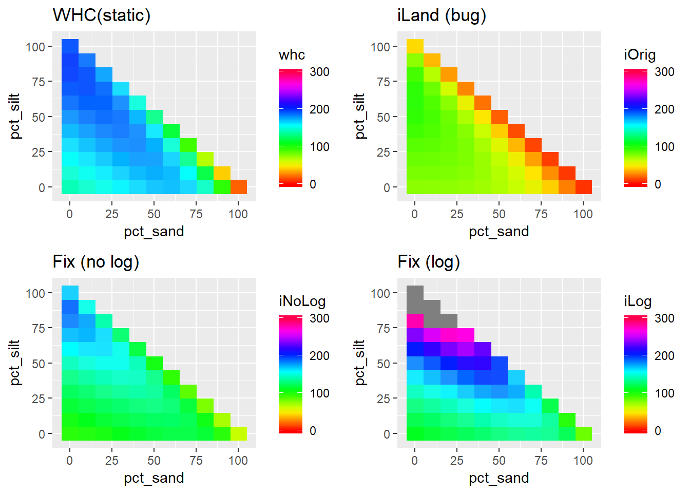
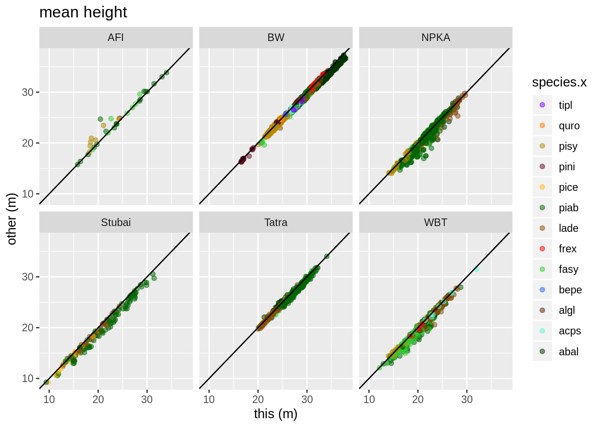
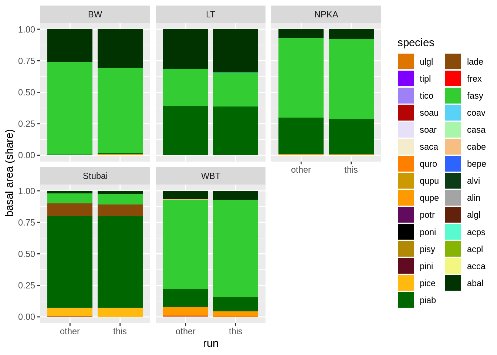

## The problem

The modeling of soil physics related to water in iLand water cycle is based on the approach of:

[Schwalm C, Ek A, 2004](http://dx.doi.org/10.1016/j.ecolmodel.2004.04.016). A process-based model of forest ecosystems driven by meteorology, Ecological Modelling

The model in the paper uses two approaches for the water cycle:

* an estimation of the water holding capacity (WHC)
* a calculation of the soil water potential (SWP) at any given level of water within the “bucket”

While the WHC calculation uses Kilopascal as the resulting unit, the SWP uses Megapascal. Unfortunately, the original iLand code erroneously assumed also KPa for the SWP calculation; consequently, the plant usable water is retrieved from the power function not between 15-4000 KPa, but between 15-4000 MPa. Due to this error the resulting water holding capacity in iLand was too low (about a factor of two for most textures, and for very sandy soils even higher).

 The calculation of [evapotranspiration](water-cycle.qmd) in iLand is based on the implementation of the Penman-Monteith equation in the original 3-PG model (Landsberg and Waring). A key parameter is the maximum canopy conductance (“maxCanopyConductance” in m/s). The literature suggests no significant differences between species ([Körner 1994](https://link.springer.com/chapter/10.1007/978-3-642-79354-7_22)), and [Keliher et al (1995)](https://doi.org/10.1016/0168-1923(94)02178-M) report values for conifers (0.0212 +- 0.0071) and deciduous temperate forests (0.0207 +- 0.0065). (Figure 1).

The previous parameterization of the “maxCanopyConductance” parameter in iLand (for Europe) was 0.015 for most species (and 0.014 for very drought tolerant species such as Pinus sylvestris and oak species).

 Figure 1. Reported values for maximum canopy conductance (Gsmax) in Keliher et al 1995.

## Fix for the problem

### iLand

A fix for the bug is to update the SWP equation to work with KPa. The equation (83) in Schwalm & Ek includes a factor to convert from log-10 to log space; since this factor is not present in the original Cosby paper, and the calculated WHCs without this factor are more realistic (see watercycle_2019.html, and Figure 2 below), we removed the factor.

This fix is included in all iLand versions with a SVN number >=1397.

To facilitate testing iLand with the "buggy" water cylce, the model includes a setting *model.settings.waterUseLegacyCalculation *that, when set to true uses the old (faulty) formulation. (Note: this setting will be removed again).

### Species parameters

We changed “*maxCanopyConductance*” to the literature values (i.e., 0.0212 for conifers, 0.0207 for deciduous species, see Figure 1 above).

## Effects of the change

### Water holding capacity

Due to the change the simulated effective water holding capacity of a soil changed considerably (Note that iLand does not calculate WHC and the reported values are assuming default thresholds of 15 kPa (field capacity) and 1500 kPa (permanent wilting point)).
The calculated WHCs for average textures are about two times larger in the updated version; for very sandy soils the difference is much more distinct.

Figure 2. Water holding capacity (mm for a soil depth 1m) for different soil textures (sand + silt + clay = 100). Top left: static estimate (based on Schwalm & Ek), top right: old iLand version (with the error), bottom left: correct equation (but without the extra log(10) factor), bottom right: original equation (as in the Schwalm & Ek paper). iLand now uses the "Fix (no log)" version of the formulation.

## Effects on dynamic simulations with iLand

The combined model and parameter update results in higher values for evapotranspiration and a slightly higher sensitivity to water stress, but over the board the model behavior showed only minor changes.

### Productivity tests (Europe)

Figure 3 shows results of productivity tests across five European landscapes and 34 points of the Austrian Forest Inventory (AFI).

Figure 3. Comparison of productivity runs showing mean stand height at age 100. This=new version and parameter changes, other=old version; AFI=points of Austrian Forest Inventory, BW=Bucklige Welt, NPKA=Nationalpark Kalkalpen, Stubai=Stubai valley, Tatra=Lower Tatra, WBT=Weissenbachtal. Productivity increased slightly especially for NPKA and WBT.

### Potential natural vegetation (Europe)

Figure 4 shows runs with the updated version of iLand ("this") and version before the update ("other").

Figure 4. Basal area shares after 1000 years of simulation for European landsacapes ("BW": bucklige Welt, "LT": lower tatra, "NPKA": Nationalpark Kalkalpen, "Stubai": Stubaital, "WBT": Weissenbachtal). The "this" bar is the updated model version, the "other" bar the old version.

## Additional information

The attached ZIP (see in the files section at the end of page) contains more details of the conducted tests, and the R-markdown file used to calculate the effect on the water holding capacity.

### Updated iLand version

An updated version of iLand is attached to this page (executable files for Windows, *iland*, *ilandc*). In addition, the updated version of iLand (including required libraries) can be found here:

https://bokubox.boku.ac.at/index.php/#e8c8e935fbed70a21f97b92e91edb2b0

The "executable_qt512.zip" contains all the required libraries and files, and the *iland.exe* and *ilandc.exe* are the updated executables (copy those over the files that come with the ZIP archive). In addition, "src_20190503.zip" is a current snapshot of the iLand source code.

### Species parameter set

The updated species parameter set for Europe is attached to this page.
