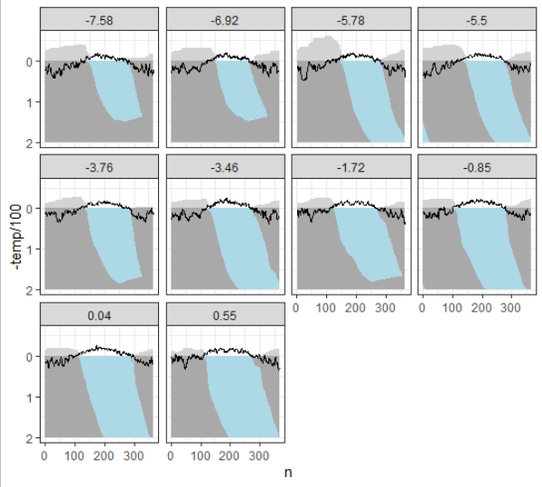

The permafrost module of iLand simulates permafrost and soil-surface organic layer (SOL) dynamics at a fine spatial (1 ha) and temporal (daily) resolution. It efficiently models daily changes in permafrost depth, annual SOL accumulation, and their complex effects on boreal forest structure and functions.


<h1 class="showhide_heading" id="Permafrost_Dynamics">**Permafrost Dynamics**</h1>


The module simulates the annual freeze-thaw cycle of the active layer, driven by heat transfer from the atmosphere and the deeper permafrost layer. Key elements include:


<ul>
	<li>Active Layer: The top layer of soil that freezes and thaws annually.</li>
	<li>Zero Isoline: The depth where the soil temperature is 0°C, separating frozen and thawed soil.</li>
	<li>Energy Fluxes:</li>
	<li> Primary Flux: Heat transfer from the atmosphere to the soil, driving active layer dynamics.</li>
	<li> Secondary Flux: Heat transfer from the deeper permafrost layer, influencing the freezing process.</li>
	<li>Resistances: Thermal resistances of snow, SOL, and mineral soil are considered to affect heat transfer.</li>
	<li>Snow Depth: Modeled as a function of precipitation and temperature, affecting the insulating properties of the soil</li>
</ul>


Soil Organic Layer (SOL):


<ul>
	<li> Composition: Includes litter and dead moss.</li>
	<li> Dynamics: Depth is modeled based on litter and coarse wood production and decomposition.</li>
	<li> Thermal Conductivity: Varies with soil moisture and texture.</li>
</ul>

<h2 class="showhide_heading" id="SOL_and_Moss_Dynamics">**SOL and Moss Dynamics**</h2>


The module also simulates the growth dynamics of the moss layer, which plays a crucial role in insulating the permafrost. Key features include:


<ul>
	<li>Moss Growth: Influenced by light availability (affected by canopy cover), temperature, and litter accumulation.</li>
	<li>Moss Litter: Decomposes and contributes to the SOL, influencing its insulating properties.</li>
	<li>Effects on Ecosystem:</li>
	<li>Tree Establishment: Thick SOL layers can hinder tree seedling establishment.</li>
	<li>Water Cycle: Permafrost and SOL depth affect water availability for trees.</li>
	<li>Fire Dynamics: The moss layer acts as both fuel and insulation in fire events.</li>
</ul>

<h2 class="showhide_heading" id="Settings_in_the_project_file">**Settings in the project file**</h2>


The “permafrost” section is a sub-section of “*model.settings*”. Example with full names: *model.settings.permafrost.lambdaSnow, model.settings.permafrost.moss.light_sat. *To enable / switch on the module, set *model.settings.permafrost.enabled* to *true*.


<table class="wikitable table table-striped table-hover">
	<tbody>
		<tr>
			<td class="wikicell">

			**Key**</td>
			<td class="wikicell">

			**Datatype**</td>
			<td class="wikicell">

			**Description**</td>
		</tr>
		<tr>
			<td class="wikicell">

			**enabled**</td>
			<td class="wikicell">

			Boolean</td>
			<td class="wikicell">

			Permafrost sub module switched on when true</td>
		</tr>
		<tr>
			<td class="wikicell">

			**onlySimulate**</td>
			<td class="wikicell">

			Boolean</td>
			<td class="wikicell">

			if true, permafrost is calculated but has no effect on the water cycle</td>
		</tr>
		<tr>
			<td class="wikicell">

			**initialGroundTemperature**</td>
			<td class="wikicell">

			numeric</td>
			<td class="wikicell">

			Initial temperature in depth ‘groundBaseDepth’ below the active layer: at depth "groundBaseDepth" the temperature is assumed to remain +- constant within a year and to follow MAT with a 10yr delay. The initial value is given with 'initialGroundTemperature'. and the depth from which thermal energy flows</td>
		</tr>
		<tr>
			<td class="wikicell">

			**initialDepthFrozen**</td>
			<td class="wikicell">

			Numeric</td>
			<td class="wikicell">

			depth (m) up to which the soil is frozen at the start of the simulation (1st of January). For permanent permafrost the value is capped at 2m.</td>
		</tr>
		<tr>
			<td class="wikicell">

			**groundBaseDepth**</td>
			<td class="wikicell">

			Numeric</td>
			<td class="wikicell">

			depth (m) of the zone below the active layer from where the secondary heat flux (from below) originates</td>
		</tr>
		<tr>
			<td class="wikicell">

			**lambdaOrganicLayer**</td>
			<td class="wikicell">Numeric</td>
			<td class="wikicell">

			thermal conductivity [W/m*K](wmk.qmd) of soil organic layer and moss</td>
		</tr>
		<tr>
			<td class="wikicell">

			**organicLayerDensity**</td>
			<td class="wikicell">

			Numeric</td>
			<td class="wikicell">

			density (kg/m3) of the soil organic layer (default: 50)</td>
		</tr>
		<tr>
			<td class="wikicell">

			**organicLayerDefaultDepth**</td>
			<td class="wikicell">

			Numeric</td>
			<td class="wikicell">

			depth of the soil organic layer (m) (only relevant when dynamic carbon cycle is disabled) (default: 0.1)</td>
		</tr>
		<tr>
			<td class="wikicell">

			**maxFreezeThawPerDay**</td>
			<td class="wikicell">

			Numeric</td>
			<td class="wikicell">

			cap for daily freezing and thawing (mm water column)</td>
		</tr>
		<tr>
			<td class="wikicell">

			***Section moss***</td>
			<td class="wikicell"> </td>
			<td class="wikicell"> </td>
		</tr>
		<tr>
			<td class="wikicell">

			**biomass**</td>
			<td class="wikicell">

			Numeric</td>
			<td class="wikicell">

			initial life moss kg/ha</td>
		</tr>
		<tr>
			<td class="wikicell">

			**bulk_density**</td>
			<td class="wikicell">

			Numeric</td>
			<td class="wikicell">

			Density of the moss layer (kg/m3)</td>
		</tr>
		<tr>
			<td class="wikicell">

			**light_k**</td>
			<td class="wikicell">

			Numeric</td>
			<td class="wikicell">

			Light extinction coefficient used for tree canopy and moss</td>
		</tr>
		<tr>
			<td class="wikicell">

			**light_comp**</td>
			<td class="wikicell">

			Numeric</td>
			<td class="wikicell">

			light compensation point: light level (proportion of light above canopy) above which photosynthesis is possible</td>
		</tr>
		<tr>
			<td class="wikicell">

			**light_sat**</td>
			<td class="wikicell">

			Numeric</td>
			<td class="wikicell">

			light saturation point: level of light (relative to light level above canopy) above which an increase in light does not increase GPP</td>
		</tr>
		<tr>
			<td class="wikicell">

			**respiration_b**</td>
			<td class="wikicell">

			Numeric</td>
			<td class="wikicell">

			Annual loss of moss biomass due to respiration (flux to atmosphere)</td>
		</tr>
		<tr>
			<td class="wikicell">

			**respiration_q**</td>
			<td class="wikicell">

			numeric</td>
			<td class="wikicell">

			Annual loss of moss biomass due to turnover (flux to litter)</td>
		</tr>
		<tr>
			<td class="wikicell">

			**CNRatio**</td>
			<td class="wikicell">

			Numeric</td>
			<td class="wikicell">

			CN-ratio of moss litter entering the litter pool of iLand</td>
		</tr>
		<tr>
			<td class="wikicell">

			**r_decomp**</td>
			<td class="wikicell">

			Numeric</td>
			<td class="wikicell">

			Decomposition rate of moss litter that enters the litter pool of iLand</td>
		</tr>
		<tr>
			<td class="wikicell">

			**r_deciduous_inhibition**</td>
			<td class="wikicell">

			Numeric</td>
			<td class="wikicell">

			Parameter to calculate inhibition effect of fresh broadleaved litter (default: 0.45)</td>
		</tr>
	</tbody>
</table>


**Related (new) parameters**


<table class="wikitable table table-striped table-hover">
	<tbody>
		<tr>
			<td class="wikicell">

			**Key**</td>
			<td class="wikicell">

			**Datatype**</td>
			<td class="wikicell">

			**Description**</td>
		</tr>
		<tr>
			<td class="wikicell">

			**model.settings.snowDensity**</td>
			<td class="wikicell">

			Numeric</td>
			<td class="wikicell">

			Density of snow in kg/m³ (default: 300)</td>
		</tr>
		<tr>
			<td class="wikicell">

			**model.settings.snowInitialDepth**</td>
			<td class="wikicell">

			Numeric</td>
			<td class="wikicell">

			Depth of the snow pack (in m) at the start of the simulation (default: 0)</td>
		</tr>
	</tbody>
</table>

<h3 class="showhide_heading" id="a8df6fbcc43d31d99e5112eb009ed8a2d"> </h3>

<h3 class="showhide_heading" id="Permafrost_visualization">**Permafrost visualization**</h3>


When the permafrost module is enabled, you can visualize certain aspects in iLand. The following layers are available in the 'permafrost' section:


<table class="wikitable table table-striped table-hover">
	<tbody>
		<tr>
			<td class="wikicell">

			**Option**</td>
			<td class="wikicell" colspan="2">

			**description**</td>
		</tr>
		<tr>
			<td class="wikicell">

			**maxDepthFrozen**</td>
			<td class="wikicell" colspan="2">

			maximum depth of freezing (m). Is 2m for full freeze.</td>
		</tr>
		<tr>
			<td class="wikicell">

			**maxDepthThawed**</td>
			<td class="wikicell" colspan="2">

			maximum depth of thawing (m). Is 2m for fully thawed soil</td>
		</tr>
		<tr>
			<td class="wikicell">

			**deepSoilTemperature**</td>
			<td class="wikicell" colspan="2">

			temperature of ground deep below the soil (C)</td>
		</tr>
		<tr>
			<td class="wikicell">

			**maxSnowCover**</td>
			<td class="wikicell" colspan="2">

			maximum snow height (cm)</td>
		</tr>
		<tr>
			<td class="wikicell">

			**SOLDepth**</td>
			<td class="wikicell" colspan="2">

			depth of the soil organic layer (litter+dead moss) (cm)</td>
		</tr>
		<tr>
			<td class="wikicell">

			**moss**</td>
			<td class="wikicell" colspan="2">

			depth of the life moss layer (cm)</td>
		</tr>
	</tbody>
</table>


Note that you can access / retrieve those grids in Javascript, e.g., to save them as files for external analysis.


<h2 class="showhide_heading" id="a8df6fbcc43d31d99e5112eb009ed8a2d_2"> </h2>

<h2 class="showhide_heading" id="Species_parameter_related_to_permafrost">**Species parameter related to permafrost**</h2>


The (new) species parameter “estSOLthickness” is used to specify the species-specific establishment response to thick soil organic layer (0: no effect).


<h2 class="showhide_heading" id="Permafrost_related_outputs">**Permafrost related outputs**</h2>


**Water-Output**


Columns related to permafrost in the water output (annual timesteps)


<table class="wikitable table table-striped table-hover">
	<tbody>
		<tr>
			<td class="wikicell">

			**Column**</td>
			<td class="wikicell" colspan="2">

			**description**</td>
		</tr>
		<tr>
			<td class="wikicell">

			**maxDepthFrozen**</td>
			<td class="wikicell" colspan="2">

			Permafrost: maximum depth of freezing (m). The value is 2m when soil is fully frozen in a year."</td>
		</tr>
		<tr>
			<td class="wikicell">

			**maxDepthThawed**</td>
			<td class="wikicell" colspan="2">

			Permafrost: maximum depth of thawing (m). The value is 2m if soil is fully thawed in a year.</td>
		</tr>
		<tr>
			<td class="wikicell">

			**maxSnowCover**</td>
			<td class="wikicell" colspan="2">

			Permafrost: maximum snow height (m) in a year.</td>
		</tr>
		<tr>
			<td class="wikicell">

			**SOLLayer**</td>
			<td class="wikicell" colspan="2">

			Permafrost: total depth of soil organic layer (excl. life moss) (m).</td>
		</tr>
		<tr>
			<td class="wikicell">

			**mossLayer**</td>
			<td class="wikicell" colspan="2">

			depth of the life moss layer (m).</td>
		</tr>
	</tbody>
</table>


 


**Debug-Output (water)**


Daily values for the state of permafrost (per resource unit) are in the water-debug output:


<table class="wikitable table table-striped table-hover">
	<tbody>
		<tr>
			<td class="wikicell">

			Column</td>
			<td class="wikicell" colspan="2">

			description</td>
		</tr>
		<tr>
			<td class="wikicell">

			pftop</td>
			<td class="wikicell" colspan="2">

			top of frozen layer (m) when thawing (above that soil is thawed)</td>
		</tr>
		<tr>
			<td class="wikicell">

			pfbottom</td>
			<td class="wikicell" colspan="2">

			bottom of the frozen layer (m) (important for seasonal permafrost; soil is frozen *up to* this depth), for permanent permafrost, the bottom is 2m</td>
		</tr>
		<tr>
			<td class="wikicell">

			pffreezeback</td>
			<td class="wikicell" colspan="2">

			depth (m) up to which the soil is frozen again (in autumn)</td>
		</tr>
		<tr>
			<td class="wikicell">

			delta_mm</td>
			<td class="wikicell" colspan="2">

			change of water (mm within iLand water bucket), freezing is negative</td>
		</tr>
		<tr>
			<td class="wikicell">

			delta_soil</td>
			<td class="wikicell" colspan="2">

			change of ice layer (m) (within iLand water bucket), freezing is negative</td>
		</tr>
		<tr>
			<td class="wikicell">

			thermalConductivity</td>
			<td class="wikicell" colspan="2">

			Current conductivity of mineral soil [W / m2 / K](w-m2-k.qmd)</td>
		</tr>
		<tr>
			<td class="wikicell">

			soilfrozen</td>
			<td class="wikicell" colspan="2">

			depth of soil (m) that is currently frozen (this is a part of the soil plant accessible soil)</td>
		</tr>
		<tr>
			<td class="wikicell">

			waterfrozen</td>
			<td class="wikicell" colspan="2">

			amount of water (mm) trapped currently in ice</td>
		</tr>
		<tr>
			<td class="wikicell">

			current_capacity</td>
			<td class="wikicell" colspan="2">

			Current field capacity of the (non-frozen) soil bucket (mm)</td>
		</tr>
		<tr>
			<td class="wikicell">

			moss_fLight</td>
			<td class="wikicell" colspan="2">

			Value of the light response for moss growth</td>
		</tr>
		<tr>
			<td class="wikicell">

			moss_fDecid</td>
			<td class="wikicell" colspan="2">

			Value of the limiting factor of deciduous litter</td>
		</tr>
		<tr>
			<td class="wikicell">

			moss_fCanopy</td>
			<td class="wikicell" colspan="2">

			Response value for the drying out  effect due to canopy openness</td>
		</tr>
	</tbody>
</table>


 


<h3 class="showhide_heading" id="Creating_custom_permafrost_graphs"> Creating custom permafrost graphs</h3>


 


```r
# R example code
# rids: data.frame with a selection of resource ids
# dbg_wc: file created by debug output
ggplot( rids %>% left_join(dbg_wc) %>% group_by(rid, year) %>% mutate(n=row_number()) %>% ungroup() %>%
          mutate(   groundice.high = pmax(pftop, pffreezeback),
                    topice.min = pmin(pftop, pffreezeback)), aes(x=n)) +
  geom_ribbon( aes( ymax=2, ymin=pfbottom), fill="lightblue" ) +
  geom_ribbon( aes( ymax=pfbottom, ymin=groundice.high), fill="darkgray" ) +
  geom_ribbon( aes( ymax=groundice.high, ymin=topice.min), fill="lightblue" ) +
  geom_ribbon( aes( ymax=topice.min, ymin=0), fill="darkgray" ) +
  geom_ribbon (aes( ymax= -snow_height/300, ymin=0), fill="lightgray") +
  geom_line (aes(y=-temp/100)) +
  scale_y_reverse() + facet_wrap(~round(tmean,2)) + theme_bw()
```





The code creates figures such as:


 
