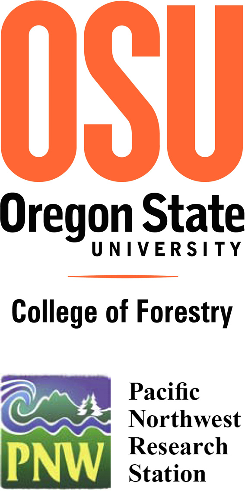

*Note that this page is part of a collection of [iLand history](history.qmd) pages and does not necessarily represent the current state of model development!*

## Rupert Seidl (project leader)

<u>[Department of Forest Ecosystems and Society](http://www.forestry.oregonstate.edu/cof/fs/index.php)</u>, Oregon State University, Corvallis, Or
<u>[Institute of Silviculture](http://www.wabo.boku.ac.at/waldbau.html)</u>, Department of Forest- and Soil Sciences, University of Natural Resources and Applied Life Sciences (BOKU) Vienna, Austria

* ***expertise:*** forest ecosystem dynamics, climate change effects on forest ecosystems, sustainable forest management, forest ecosystem modelling, disturbance ecology and modelling
* ***role in iLand:*** model development, data analysis and preparation for case studies, model evaluation, model documentation, project management
* <u>[***more***](http://www.forestry.oregonstate.edu/cof/fs/people/faculty/seidl.php)</u>
* <u>[***cv***](https://forschung.boku.ac.at/fis/suchen.person_uebersicht?sprache_in=de&menue_id_in=101&id_in=2994)</u>

## Werner Rammer (project partner)

<u>[Institute of Silviculture](http://www.wabo.boku.ac.at/waldbau.html)</u>, Department of Forest- and Soil Sciences, University of Natural Resources and Applied Life Sciences (BOKU) Vienna, Austria

* ***expertise:*** scientific/environmental computing, object oriented programming, algorithm optimization, spatial data processing and analysis, forest ecology, decision support systems
* ***role in iLand:*** model development, model implementation, model documentation
* <u>[***more***](http://www.wabo.boku.ac.at/rammer.html)</u>

## Thomas A. Spies (project partner)

<u>[Pacific Northwest Research Station](http://www.fs.fed.us/pnw/)</u>, USDA Forest Service, Corvallis, Or
<u>[Department of Forest Ecosystems and Society](http://www.forestry.oregonstate.edu/cof/fs/index.php)</u>, Oregon State University, Corvallis, Or

* ***expertise:*** forest ecology, forest succession, stand and landscape structure and dynamics, old growth forest ecology and conservation; overstory-understory relationships; coupled natural and human systems
* ***role in iLand:*** contributing to model design and development, providing expertise for ecosystem and disturbance dynamics in the Pacific Northwest, helping to set up a case study for model testing and evaluation in the Pacific Northwest
* <u>[***more***](http://www.forestry.oregonstate.edu/cof/fs/people/faculty/spies.php)</u>

## Robert M. Scheller (project partner)

<u>[Environmental Sciences and Management](http://www.pdx.edu/esm/home)</u>,
Portland State University, Portland Or

* ***expertise:*** landscape ecology, forest ecosystem ecology, fire ecology, global climate change, forest management, landscape and disturbance modeling, spatial and multivariate statistics, GIS, scientific computing/programming, remote sensing, ecosystem modelling
* ***role in iLand:*** contributing to model design and development, providing expertise in forest landscape modelling with the <u>[LANDIS](http://www.landis-ii.org/)</u> approach, helping to set up a case study for model testing and evaluation in the Pacific Northwest
* <u>[***more***](http://web.pdx.edu/~rmschell/index.htm)</u>

## Manfred J. Lexer (project partner)

<u>[Institute of Silviculture](http://www.wabo.boku.ac.at/waldbau.html)</u>, Department of Forest- and Soil Sciences, University of Natural Resources and Applied Life Sciences (BOKU) Vienna, Austria

* ***expertise:*** forest ecosystem dynamics, climate change effects on forest ecosystems, decision support systems, sustainable forest management, forest ecosystem modelling, multi-criteria analysis
* ***role in iLand:*** contributing to model design and development, helping to set up a case study for model testing and evaluation in the Eastern Alps, Austria, providing expertise with regard to aspects of using the model framework in sustainable forest management decision support
* <u>[***more***](http://www.wabo.boku.ac.at/lexer.html)</u>
