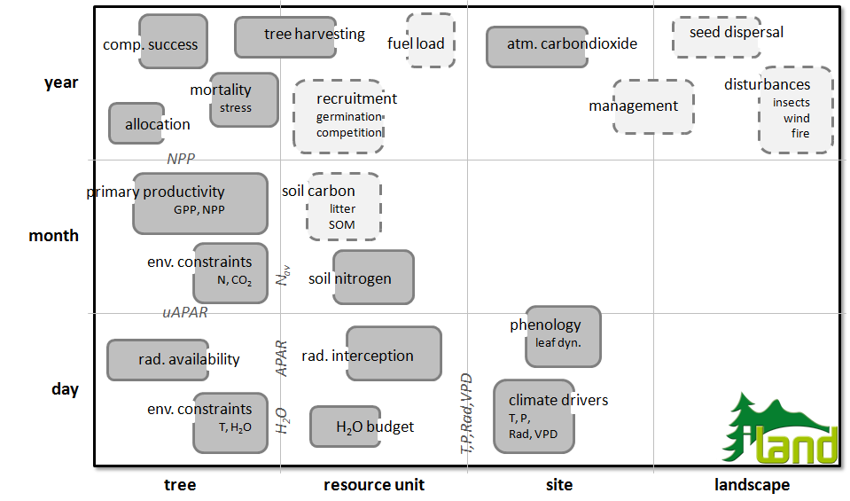

Consistent scaling of ecosystem processes across temporal and spatial scales is one of the key strengths of forest ecosystem models ([Wolfslehner and Seidl 2009](http://dx.doi.org/10.1007/s00267-009-9414-5)). However, it is simultaneously one of the biggest challenges in modeling (see [Robinson and Ek 2000](http://dx.doi.org/10.1139/cjfr-30-12-1837)), inter alia due to the fact that (cf. [Bugmann et al. 2000](http://dx.doi.org/10.1023/A:1005603011956))

* ecosystems are hierarchically organized as well as
* inherently heterogeneous, and
* processes are strongly nonlinear

Scaling is a particular challenge for iLand, since the aim of the project is to address relevant aspects of forest ecosystem dynamics in a process-based manner across various scales. Notwithstanding the general fact that a good model is only as complex as necessary (see [here](iland-model-complexity-and-its-niche-in-the-landscape-of-models.qmd), and e.g. [Kimmins et al. 2008](http://dx.doi.org/10.1016/j.foreco.2008.03.011)) and the notion of [Mladenoff (2004)](http://dx.doi.org/10.1016/j.ecolmodel.2004.03.016) that detailed process representation is not necessarily benefiting landscape models iLand aims at a high level of process resolution in order to simulate forest dynamics as an emergent property of the model ([Grimm and Railsback 2005](http://tinyurl.com/nj757y)). iLand is conceived as a platform for consistently scaling and integrating e.g., the effects of climate change from the level of tree physiology to the level of forest landscapes. Consequently, scaling is of central importance to our modeling in iLand.

We generally follow previous individual-based process model approaches (e.g., [Bugmann et al. 1997](http://tinyurl.com/yjf5cam)) in selecting a multi-scale design, where processes are treated on their respective spatial and temporal resolution. Following the suggestion of [Mäkelä (2003)](http://dx.doi.org/10.1139/X02-130) we adapted this approach into a hierarchical framework, where (i) lower level processes are modeled explicitly and aggregated to serve as input to processes at higher hierarchical levels while (ii) higher level processes serve as constraints for finer scale computations.
This hierarchical multi-scale design has particular benefits for iLand:

* In scaling from individual tree to landscape scale particularly robust approaches are required in order to achieve realistic long-term large-scale model behavior. In other words, small errors at the individual tree level could result in unrealistic ecosystem dynamics if scaled to the landscape scale in a pure bottom-up approach. Implementing higher-level feedbacks and constraints to processes at finer scales is aimed to reduce such scaling errors and introduces meaningful checks and balances for long-term predictions
* A multiscale hierarchical framework is particularly well suited to incorporate the hybrid, multi-concept approach as envisioned for iLand (cf. [Mäkelä et al. 2000](http://treephys.oxfordjournals.org/cgi/reprint/20/5-6/289), [Seidl et al. 2005](http://treephys.oxfordjournals.org/cgi/reprint/25/7/939) for a discussion and realization of a hybrid model concept). In harnessing concepts from tree physiology, individual-based ecology and landscape ecology interfaces and feedbacks between processes and scales are important and can be stringently accommodated in such a scaling approach.
* iLand should be testable against expected patterns and data at various levels. Adopting a hierarchical approach allows to isolate specific levels particularly for evaluation purposes and thus supports a more rigorous testing and evaluation of the model ([Mäkelä 2003](http://dx.doi.org/10.1139/X02-130)).

Examples for multi-scale interactions via emergence/ constraints within iLand are, for instance, the representation of [radiation interception](primary-production.qmd) or [height : diameter increment](allocation.qmd) in the model. Radiation interception is not modeled at the individual tree level (cf. [Duursma and Mäkelä 2007](http://treephys.oxfordjournals.org/cgi/reprint/27/6/859)) but for [resource units](resource-units.qmd), applying the robust formulation of Beers law. This resource unit level absorption subsequently serves as constraint for the individual tree [radiation availability](individual-tree-light-availability.qmd), derived from competitive success and absorption potential (i.e. leaf area).
Another example is the [allocation](allocation.qmd) of stem growth to height and diameter increment, which is modeled dynamically as a function of individual-tree light availability in iLand. However, the overall range of height to diameter ratios of annual increment is constrained by empirical allometric functions (cf. [Bossel 1996](http://dx.doi.org/10.1016/0304-3800(95)00139-5), [Peng et al. 2002](http://dx.doi.org/10.1016/S0304-3800(01)00505-1)). Figure 1 summarizes the major spatial and temporal scales for selected processes in iLand by means of a Stommel diagram.

**Figure 1: Spatio-temporal scales of major processes in iLand. Dashed boxes are not yet implemented as of December 2009.**

::: {.callout-note title="citation"}
[Seidl, R., Rammer, W., Scheller, R.M., Spies, T.A. 2012](http://dx.doi.org/10.1016/j.ecolmodel.2012.02.015). An individual-based process model to simulate landscape-scale forest ecosystem dynamics. Ecol. Model. 231, 87-100.
:::

