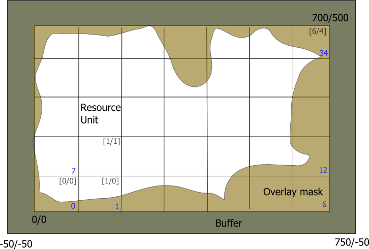

When referring to XML settings defined in the [project file](project-file.qmd), the name of the respective key is set in an *italic* typeface and a dot-notation is used. E.g., *system.path.home* refers to the element *home*, which is a child of *path*, which is as a child of *system*. The topmost node (*project*) is omitted.

## General types of simulation setups

### single resource units and the *torus*

The most basic case is to set up iLand to use a single resource unit (a single stand) for simulations, which can be useful for testing growth and yield and general parameterization tasks. However, you can facilitate the fact that iLand is optimizied for simulating a large number of trees simultaneously by doing many single-stand simulations in parallel. This can be achieved, since each resource unit can be set up to use different climate data input, different soil data input and different initialization (see below). In addition, using the *torus* mode (*model.parameter.torus*, see [project file](project-file.qmd)), also the light calculations and seed calculations are constrained to each resource unit and do not influence each other.

### generic landscapes

Generic landscapes use the landscape features of iLand (e.g. [seed dispersal](external-seeds.qmd) or [disturbances](disturbance-modules.qmd)) without being linked 1:1 to a real landscape. Environmental conditions can either be uniform for the whole landscape or differ for each resource unit, e.g. to create a climatic or edaphic gradient. See below on how to setup such gradients ("environment files"). By default, generic landscapes are embedded in a "forested" landscape, i.e. there are no stand edges and the edge of the simulated area. For a more fine-grained control, the "real landscape" option must be used.

### "real" landscapes

The setup of "real" landscapes is thoroughly discussed [here](landscape-setup.qmd). In this setup, GIS-based data is used (digital elevation models, polygonal stand shapes, spatial explicit management, maps of soil and climate properties, ...).

## The size of the simulated area

The extent of the simulated area is defined in the section *model.world* using the metric properties *width* and *height* (i.e. *model.world.width* and *model.world.height*). The *buffer* property defines additional space that envelopes the extents.

<small>Fig.1. A landscape example. Coordinates are in meters. Grey coordinates in square brackets in the upper right corner of resource units are the x- and y- indices of resource units, the blue number in the lower right corner denote the resource-unit-index which is used e.g. for database output. Brown: area excluded due to the overlay mask, Dark-brown: buffer area around the landscape.</small>

In this example, the landscape is 700x500m, i.e. facilitates 7x5 resource units. The *buffer* is 50m, thus the full landscape is 800x600m. The origin (0m/0m) denotes the lower left corner of the resource index in the lower left corner of the landscape. The lower left (i.e. south-west) corner of the full landscape has the coordinates (-50m/-50m) and the upper right (i.e. north-east) a value of (750m/550m).

## Overlay mask

The smooth edges of the overlay mask in the above picture are a little misleading - actually the overlay mask is also a rasterized image with a grid resolution of 10x10m (which is the resolution of the height-grid).
How to set up the project area is described [here](landscape-setup.qmd). Alternatively, the overlay mask can be specified in fact also as an image: the *model.world.areaMask.imageFile* property defines the filename of an image which is expected being large enough to cover the whole landscape (including the buffer zone). Black pixels define regions which are outside of the project area.
Note that
In the depicted example above, the mask image should have a size of 80x60pixel (i.e. 800x600m). Moreover, the mask is only applied when *model.world.areaMask.enabled* is set to *true*.

## spatially distributed parameters

The next step after defining the size and the boundaries of the project area is to define the actual content, i.e. the distribution of properties atop of the landscape.
The chosen approach is based on a text-file-based table which is very flexible with regard to the content of this table.
The keys *model.world.environmentFile*, *model.world.environmentEnabled*, and *model.world.environmentMode* are the main controls. If *environmentEnabled* is set to *true*, then the *environmentFile* will be loaded and applied during the model creation. How the spatial referencing between data file resource units is established, depends  on the value of the *environmentMode* key which must be either *matrix* or *grid*:

### *matrix* mode

Each row in the driver file describes the properties of one resource unit. The location is defined by the columns *x* and *y* (0-index-based, for the example above: x=(0..6), y=(0..4)). If an *id* column is present, the value is used for the ID of the resource unit.

### *grid* mode

In *grid* mode, each row of the driver file describes the properties of one *id* of the associated grid file. The column *id* in the driver files holds this information. The spatial grid is loaded from the file specified in *model.world.environmentGrid*. During the setup of the landscape the grid-value at the center point of each resource unit is queried. Then, the parameter values attached to that *id* are used to initialize the resource unit.

### data values

The other columns of environment file refer to keys in the project file and provided values are used during the setup of the respective resource unit. That way every key of the project file structure could be modified, although only few of them would be effective. The following table lists some possible keys:

| **key** | **description** |
| --- | --- |
| x | 0-based index of the resource unit in x-direction (matrix mode); x-coordinate of center of the resource unit (grid mode) |
| y | 0-based index of the resource unit in y-direction (matrix mode); y-coordinate of center of the resource unit (grid mode) |
| model.species.source | database table source for species parameter sets |
| model.site.availableNitrogen | available nitrogen of the unit (kg/ha/yr) |
| model.site.soilDepth | depth of soil (cm) of the unig |
| model.climate.tableName | climate data for that unit |
| model.initialization.file | file used for the tree initialization (if string is empty, no trees will be initialized on that RU) |

If the environment file **does not** contain a specific key, then the value provided in the project file is used throughout the landscape.

Basically, there are three groups of settings:

* simple site variables: e.g. available nitrogen: unique values for resource units
* links: e.g. species sets, climate: units with equal values refer to the same entity. E.g. if 10 units refer to "climate A" and 10 to "climate B", "climate A" and "climate B" are loaded once and are used for all respective resource units.
* initialization: keys referring to the tree initialization

## digital elevation model

iLand uses a digital elevation model (DEM) of the project area as a representation of the terrain. The DEM is expected to be a text file in the [ESRI raster format](http://en.wikipedia.org/wiki/Esri_grid). The resolution of the input file may vary and iLand creates internally a DEM with a 10m resolution. In addition, maps with slope and aspect are calculated (following [Burrough and Mc Donell, 1998](http://uqu.edu.sa/files2/tiny_mce/plugins/filemanager/files/4280125/Principles of Geographical Information Systems.pdf) (Principles of Geographical Information Systems, Oxford University Press, New York, p.190). The DEM is loaded from the file specified in the *DEM* key of the *world* section of the [project file](project-file.qmd) and matched to the coordinates specified in the same section.