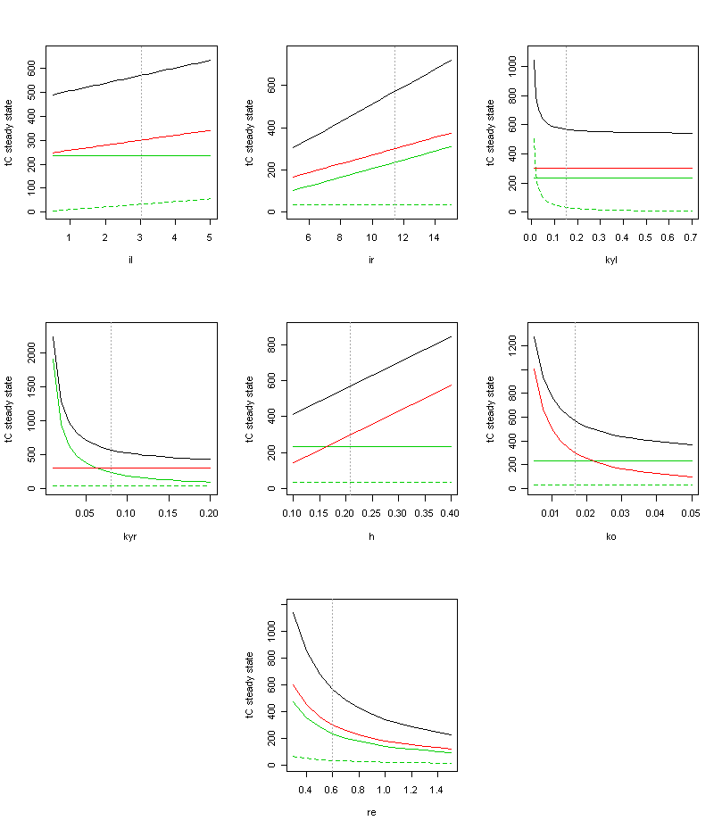
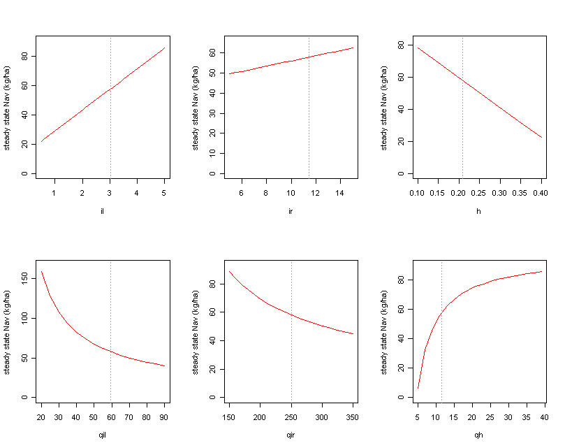

# Background

Two general approaches exist to set up ecosystem models with regard to soil model parameters and initial conditions for simulations.

1. Using observed soil data (mostly imputed to study entities based on stand and site conditions) as initial conditions
1. Apply a spin-up run to self-initialize the models' soil pools

Approach 1 has the advantage that it uses what (little) we observe in terms of soils directly, i.e. it is the closest we can usually get with regard to using ground-truth soil data as initial conditions in simulations. However, it usually requires a labor-intensive imputation routine fraught with assumptions to arrive at the require model pools and parameters for the entities to be studied, and data assimilation techniques are only as good as the (sparse) soil sampling and analysis data that is available (see e.g., [Seidl et al. 2009b](http://tinyurl.com/2cttxvl) for a recent approach). Another possible disadvantage of this approach is that data and parameters gathered from soil samples and the literature do not necessarily grant internal consistency in the simulation model. Due to the potential of vegetation-soil feedbacks initial values derived in this manner might not be stable in the model, and simulated changes in soil pools (particularly in the first years of a simulation) can be artifacts of the model for a given set of parameters and initial values (rather than effects of the studied factors e.g. management, climate, disturbances).

Approach 2 circumvents this problem in generating soil data consistent with the models structure and parameters by letting the model run for an extensive time period, i.e. spinning up the soil pools to their steady state (e.g. [Thronton and Rosenbloom 2005](http://dx.doi.org/10.1016/j.ecolmodel.2005.04.008)). However, these initial soil pools, based on model logic and parameters determined from the literature, do not necessarily correspond to available observations for the study region, and assimilating such data into the approach can be complicated (and sometimes impossible as it might require structural changes in model processes).

        *

# A data-driven steady state initialization

Both of the above mentioned initialization and parametrization routines are generally applicable in iLand. The model can handle empirically derived soil data and parameters as input, but due to its computational efficiency it is also well suited for spin-up exercises. However, one main advantage of the simple [#The_ICBM/2N_approach|soil modeling approach](soil-c-and-n-cycling.qmd) chosen in iLand is that it is analytically solvable, which allows us to combine steady state initialization with assimilation of observed data, i.e. a 'best of both worlds' of the two general initialization and parametrization routines described above. Here the rationale and sequence of steps of such a data-driven steady state initialization is described. An accompanying R script is available upon request.

## Step 1: starting points

We assume that species-specific information on litter quality (C/N ratio, decomposition rates) is available from the literature (see for instance [Adair et al. 2008](http://dx.doi.org/10.1111/j.1365-2486.2008.01674.x) for an extensive data set). In iLand those parameters are required in the [species parameter set](species-parameter.qmd). [Currie et al. (2010)](http://dx.doi.org/10.1111/j.1365-2486.2009.02086.x), for instance, give general regressions for calculating decomposition rates from climate and litter quality indicators.
We furthermore assume that some information on steady state productivity (e.g. NPP) is available for the sites to be initialized, as well as the corresponding species composition (and thus composite litter quality). If none of the latter is available for the study region, iLand can be used to generate this information by running the model with static *Nav* (i.e. equivalent to a fertility rating approach, cf. [Landsberg and Waring 1997](http://dx.doi.org/10.1016/S0378-1127(97)00026-1)). Information on steady state leaf area can in conjunction with iLand model parameters be used to determine what share of the steady state NPP enters the labile and refractory soil pools, respectively.
In addition, the long-term average climate influence on decomposition (*re*) can be either derived from the model or estimated based on knowledge of site conditions, decomposition trials and climate information (again, if no information is available, the data of [Adair et al. (2008)](http://dx.doi.org/10.1111/j.1365-2486.2008.01674.x) give a good starting point for orientation, however, please note that unlike their data iLand decomposition rates and climate modifiers are standardized to 10 ˚C).

## Step 2: plausibility of litter pools

Litter pools are highly variable and depend on the immediate management and disturbance history of a site, and are thus not recommended for parametrization against observed data if information on these boundary conditions are not available. However, it should be evaluated if the steady state litter pool sizes emerging from the species-specific litter parameters and the sites' climate are within the plausible range observed for the ecosystem.

## Step 3: optimization of soil organic matter parameters

Soil organic matter (SOM) is the last ecosystem C pool to attain steady state and is less sensitive to immediate changes in disturbance history, which makes it a better parameter for parametrization against data where this historic information is not known (i.e. data from large scale soil surveys such as used in [Seidl et al. 2009b](http://tinyurl.com/2cttxvl)). Observed data on steady state SOM can subsequently be used to optimize the site-specific parameters SOM decomposition (*ko*) and humification rate (*h*) (see also the recommendation for the 'stable' pools of the [Standcarb 2 model](http://andrewsforest.oregonstate.edu/pubs/webdocs/models/standcarb2/decomp.htm), [Harmon et al. 2009b](http://dx.doi.org/10.1007/s10021-009-9256-2)). Since a particular steady state SOM can be achieved by both low-in-low-out as well as high-in-high-out fluxes additional information should be used to achieve a reliable soil parametrization. If available, data on the N cycle can be used to constrain the parameter space. For instance, if observed values for the C/N ratio of SOM are available these can be directly used for the parameter *qh* (i.e. the C/N ratio of the humification flux). If not available they can be estimated from broader soil types (cf. [Seidl et al. 2009b](http://tinyurl.com/2cttxvl)). Furthermore, given a rough estimate of leaching fluxes can be provided, mineralized N available to plants (*Nav*) in steady state conditions can be calculated analytically and used as a criteria in model parametrization. For further information and approaches see also [Kätterer and Andrén (1999)](http://dx.doi.org/10.1016/S0167-8809(98)00177-7), who used soil type information to estimate humification. As a rule of thumb *h* is the share of matter remaining after 5-10 years of decomposition according to [Andrén and Kätterer (1997)](http://www.jstor.org/stable/2641210). An empirical method of deriving such fractions from litter quality parameters is given in [Currie et al. (2010)](http://dx.doi.org/10.1111/j.1365-2486.2009.02086.x) based on long-term litter-bag experiments. [Xenakis et al. (2008)](http://dx.doi.org/10.1016/j.ecolmodel.2008.07.020) indicate possible ranges for important ICBM/2N parameters.
Either standard statistical optimization approaches (e.g. non-linear least squares, maximum likelihood) or Monte Carlo simulations through the possible parameter space can be employed to derive a parametrization that is compatible with observed data and fulfills the steady state assumptions. Note that despite the parametrization for a steady state the actually simulated soil C and N pools and fluxes will be sensitive to different levels of simulated detritus production (stand development, disturbances, management) as well as climate variability. It is furthermore important to note that the above described routine, combining both benefits of data assimilation and spin-up, is solvable (at least semi-)analytical, and thus requires much less computational efforts than a full spin-up design. If necessary, steps 1 trough 3 can be easily reiterated, e.g. if the derived steady state *Nav* level is not in accordance with the *NPP* assumed as input for the calculations in Step 1.

        *

# Sensitivity analysis

To illustrate the influence of the individual parameters on soil dynamics we conducted a sensitivity analysis with regard to (i) steady state C pools (Figure 1), and (ii) steady state plant-available nitrogen (Figure 2). Please note that for the latter there is no direct influence of decomposition rates (*kyl*, *kyr*, *ko*) and climate (*re*) under steady state, i.e. if all C pools are at their equilibrium also the available N fluxes are invariant. However, in an actual simulation changes in decomposition parameters (e.g. through changes in litter quality) and climate also exert an influence on *Nav* via changes in C fluxes.

***Figure 1: Parameter sensitivity of soil C pools (black: total C, green dashed: litter, green solid: downed woody debris, red: soil organic matter). il= input litter (tC/yr), ir= input deadwood (tC/yr), kyl= decay rate litter, kyr= decay rate downed woody debris, h= humification rate, ko= decay rate soil organic matter, re= climate modifier on decay. Exemplary parameters for a generic old growth system in the western Cascades of Oregon are indicated by dotted vertical lines.***

***Figure 2: Parameter sensitivity of plant-available nitrogen (Nav). il= input litter (tC/yr), qil=C/N ratio of litter input, ir= input deadwood (tC/yr), qir= C/N ratio of deadwood input, h= humification rate, qh= C/N ratio of humified material. Exemplary parameters for a generic old growth system in the western Cascades of Oregon are indicated by dotted vertical lines.***

::: {.callout-note title="citation"}
[Seidl, R., Spies, T.A., Rammer, W., Steel, E.A., Pabst, R.J., Olsen, K. 2012](http://dx.doi.org/10.1007/s10021-012-9587-2). Multi-scale drivers of spatial variation in old-growth forest carbon density disentangled with Lidar and an individual-based landscape model. Ecosystems, DOI: 10.1007/s10021-012-9587-2.
:::

