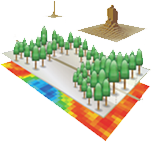
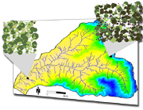
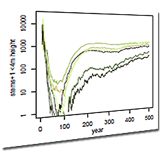
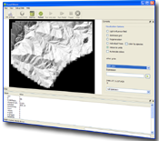
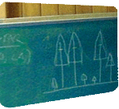

**iLand - the individual-based forest landscape and disturbance model**
Quick links: [Wiki](iland-hub.qmd)[Discord](https://discord.gg/e5trneUKav)[iLand Book](https://iland-model.org/iland-book)[Publications](iland-publications.qmd)[Get iLand](download.qmd)

        *

 
*What it is.*

iLand is a model of forest landscape dynamics, simulating individual tree competition, growth, mortality, and regeneration. It addresses interactions between climate (change), disturbance regimes, vegetation dynamics, and forest management. [Read more...](abstract.qmd)

*How it works.*
Forest ecosystems are complex adaptive systems. In iLand, their dynamics is modeled as an emergent property of interactions between adaptive agents, and their environment. iLand is a multi-scale process-based model, integrating processes from the individual tree level (e.g., competition) to the landscape scale (e.g., disturbance) in a hierarchical simulation framework. [Read more…](abstract.qmd)

*What it's good for.*

iLand simulates forest dynamics at watershed and landscape scales (i.e. 10,000 hectares and beyond) over decades and centuries. It estimates species composition and stand structure, quantifies carbon storage, and can be used to assess the effects of climate change on e.g., disturbance regimes and ecosystem services.[Read more...](abstract.qmd)

 
*Can I use it?*

Sure! iLand is a research tool already used by a growing number of scientists in the US and Europe. The iLand software is released under the GNU General Public License and [freely available.](download.qmd)

*Who's behind it.*

The principal developers of iLand are Rupert Seidl and Werner Rammer from the Ecosystem Dynamics group at theTechnical University of Munich, with contributions from experts at BOKU Vienna, OSU Corvallis, PSU Portland, and SLU Alnarp. [Read more…](team.qmd)

