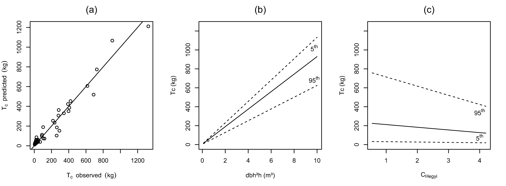

iLand aims at a spatially explicit simulation of disturbances in the context of long-term simulations of forest landscapes (102-104 ha). The overall objective is to simulate disturbances in a process-based manner (cf. [Seidl et al. 2012](http://dx.doi.org/10.1016/j.ecolmodel.2012.02.015)), i.e. address a number of important disturbance processes and their dynamic interactions explicitly (rather than lumping them into e.g. an empirically fit logistic regression). However, disturbance modules in the context of landscape simulation also need to be parsimonious due to the considerable spatial and temporal scope of forest landscape models such as iLand. The following describes a process-oriented yet parsimonious approach to simulate wind disturbance as an emerging property of dynamically simulated stand structure and landscape patterns in combination with external wind forcing. A sensitivity analysis of the core components of the iLand wind module can be found [here](wind-module-sensitivity-analysis.qmd), and more technical notes on parameters and implementation are given [here](wind-module.qmd).

## (1) Occurrence: wind events

As a result of process-orientation the wind model in iLand simulates the occurrence of wind disturbance based on actual wind speed information. This information can be derived either from a local weather station in or in the vicinity of the study landscape, or from simulations with regional climate models (e.g. [Blennow et al. 2010a](http://dx.doi.org/10.1007/s10584-009-9698-8)). From this information wind events are defined by wind speed (mean hourly wind speed) and wind direction. In the interest of computational efficiency we only explicitly consider wind events above a certain threshold wind speed percentile, with winds below such a threshold being assumed to cause no damages in the simulation (cf. [Klawa and Ulbrich 2003](http://dx.doi.org/10.5194/nhess-3-725-2003)). This percentile thus serves as a coarse filter top down threshold to call the wind computation routine only in a limited number of instances (i.e., simulation years). For these years the actual occurrence and extent of damage are subsequently simulated in detail as emergent properties of the model, as described below. Temporal scenarios of different wind climates can be accommodated in the simulations by either supplying the model with different wind event time series from climate models, or by generating wind event time series by drawing from empirically observed wind distributions. The date of occurrence of a wind event (day of year) as well as the event duration can either be determined from observations or climate models, but can alternatively also be drawn from distributions of historical observations. If detailed information on individual events are available, they can also be studied in detail with the iLand wind module, as for instance demonstrated [here](http://dx.doi.org/10.1016/j.envsoft.2013.09.018).

        *

## (2) The effect of topography on wind speed

Wind speed information are likely available only for a limited number of point locations (weather stations, climate model grid cell center points) in the landscape. To account for the effect of topography on wind speed we use a simple index of topographic exposure of a site, the topex-to-distance ([Hannah et al. 1995](http://dx.doi.org/10.1017/CBO9780511600425.007), [Quine and White 1998](http://dx.doi.org/10.1093/forestry/71.4.325)).[Hannah et al. (1995)](http://dx.doi.org/10.1017/CBO9780511600425.007) found that observed wind speeds were strongly related to topex-to-distance (TTD) values in Scotland, and [Ruel et al. (2002)](http://www.ingentaconnect.com/content/saf/njaf/2002/00000019/00000004/art00007) also report good results for applications in Canadian forests. Notwithstanding the higher process resolution of detailed airflow models (e.g. [Blennow and Sallnäs 2004](http://dx.doi.org/10.1016/j.ecolmodel.2003.10.009)), and their potential advantages in mild terrain, the TTD was chosen due to its simplicity and ease of parameterization (for a comparison of TTD to more complex airflow models see for instance [Suarez et al. 1999](http://dx.doi.org/10.1017/S1350482799001267)). In order to spatially extrapolate the wind of a certain event (cf. step 1) to the landscape accounting for the effects of topography, a regional relationship between wind speed and TTD is parameterized using standard weather station data and a digital elevation model (DEM). It is important to note that this relationship is valid only regionally, and will have to be re-parameterized for different study landscapes.

In an example for southern Sweden we used wind data from 12 weather stations ([SMHI 2011](http://www.smhi.se/klimatdata/meteorologi/vind)) and the 30m resolution DEM of [ASTER (2011)](http://asterweb.jpl.nasa.gov/gdem.asp). We for every weather station location calculated the TTD for the distances 0.5 km, 1 km, 2 km, and 3 km, and related it to the mean 10 minute wind speed recorded in 3h intervals over ten years (1996-2006) at the weather stations. We found that any single TTD index had only moderate explanatory power in the mild rolling topography of southern Sweden (but see [Hannah et al. 1995](http://dx.doi.org/10.1017/CBO9780511600425.007) for a more complex terrain). A combination of TTD indices over all distances together with elevation (using principal components regression to control for correlation between predictors), however, gave satisfactorily results, explaining 64% of the variation in mean wind speeds (Figure 1).

***Figure 1:*** Relationship of observed wind speed to predicted wind speed using (a) topex-to-distance 2km, (b) topex-to-distance 2km and elevation, and (c) topex-to-distance 0.5 km, 1 km, 2km, 3km and elevation as explanatory variables. Models (a) and (b) are simple linear regressions. Model (c) is a principal component regression.

With such a regional relationship established, a rough estimate of the local wind speed for every grid cell (e.g., iLand resource unit, currently a 100m grid) in the simulations can be derived by estimating the mean wind speed for every cell in the landscape from TTD and elevation, and relating it to the same estimate for the reference location (i.e. the location of the weather station for which the wind event was described). This results in a spatial grid of topography modifiers to the event wind speed for application in iLand. Note that the topography effect remains constant throughout the dynamic simulations, i.e. it is only calculated once for a study landscape prior to simulation.

        *

## (3) Detection of edges

We assume that major wind disturbance events occur first and foremost at stand edges, and define edges as vertical differences in tree height of >10 m ([Blennow and Sallnäs 2004](http://dx.doi.org/10.1016/j.ecolmodel.2003.10.009)). Edges are detected in iLand based on the canopy top height at 10m horizontal resolution. A pixels Moore neighborhood (i.e. its eight neighboring cells) is used to detect edges with regard to different wind directions. Cells with top height <10 m are not considered to be directly damaged by wind in iLand. The following wind damage calculation steps are executed only for the cells in the landscape that were identified as edge cells. Please note that despite using the conventional term "edge" these elements are not necessarily linear features in the landscape such as between stands, but that wind loading calculations would also be conducted for individual trees within a stand if they are >10m taller than their surrounding.

        *

## (4) Calculation of the vertical wind profile

To derive the canopy top wind speed from the above canopy wind speed (cf. step 1 and 2) a vertical wind profile is calculated, following the approach of ForestGALES ([Gardiner et al. 2000](http://dx.doi.org/10.1016/S0304-3800(00)00220-9)) described in detail by [Byrne (2011)](http://hdl.handle.net/2429/33800). Zero-plane displacement (*d0*), i.e. the height at which the wind profile changes from a logarithmic to an exponential form, is calculated according to Raupachs drag partitioning model ([Raupach 1992](http://dx.doi.org/10.1007/BF00155203), 1994, Eq. 1).

$$
d_{0}=h\cdot \left ( 1-\frac{1-e^{-(c_{d1}\cdot \lambda)^{0.5} }}{\left (c_{dl}\cdot \lambda  \right )^{0.5}} \right )
$$

with *h* the top height of a given 10 m cell, *cdl* an empirical parameter (7.5), and *λ* the frontal area index, being defined according to Eq. 2.

$$
\lambda =\frac{2\cdot r_{z}\cdot (h-h_{z})\cdot kc \cdot p}{100/n}
$$

with *rz* the crown radius, *hz* the height to the live crown, *kc* an empirical coefficient related to the crown shape, *p* a constant accounting for porosity, and *n* the number of trees per 100 m2 cell. In iLand, *rz* is available from light competition calculations, while *hz* is calculated from a fixed, species-specific ratio (also used in the ray tracing algorithm applied in the model). For wind disturbance calculations every 10 m grid cell is represented by the tallest tree occupying it, i.e. the values of the tallest individual are used in Eq. 2. In order not to overestimate the effect of smaller trees we scale *n* to the number of idealized trees of equal size as the focal tree, using tree basal area as scaling criterion. Note also that *n* does not include trees in the regeneration layer, i.e. trees <4m in height. An application of these stand level methods to sub-stand grid cells was recently successfully demonstrated by [Bryne (2011)](http://hdl.handle.net/2429/33800). Surface roughness (*Z0*) is subsequently calculated as Eq.3, following [Raupach (1994)](http://dx.doi.org/10.1007/BF00709229):

$$
z_{0}=(h-d_{0})\cdot e^{-k\cdot \gamma +0.193}
$$

with *k* the von Kaman constant (0.4) and *γ* the drag coefficient, defined as (Eq. 4)

$$
\gamma =min(\frac{1}{(C_{s}+C_{e}\cdot \frac{\lambda}{2})^{0.5}}\: ;\: 0.6)
$$

with *Cs* the surface drag coefficient (0.003) and *Ce* the element drag coefficient (0.3). The wind speed at the cell top height (*Uc*) relative to the reference wind speed 10 m above *d0* (which is assumed to represent the conditions as measured by meteorological stations, *U10*) is subsequently calculated according to Eq. (5).

$$
U_{c}=U_{10}\cdot \frac{ln(\frac{h-d_{0}}{z_{0}})}{ln(\frac{10}{z_{0}})}
$$

        *

## (5) Calculation of individual tree turning coefficient

We build our calculations of tree response to wind on the recent findings of [Hale et al. (2012)](http://dx.doi.org/10.1007/s10342-010-0448-2), who showed that – over a range of stand and soil conditions and for both deciduous and evergreen species – the ratio between the maximum turning moment (*Mmax*) and the square of the hourly wind speed at the top of the canopy (*Uc2*) was surprisingly conservative over a wide variety of tree sizes (Eq.6). For well acclimated (i.e. not recently thinned) stands they found

$$
T_{c}=117.3\cdot dbh^{2}\cdot h
$$

with *dbh* the tree diameter at breast height, and

$$
M_{max}=U_{c}^{2}\cdot T_{c}
$$

        *

## (6) Accounting for the effects of edge position, local upwind vegetation and shelter from neighbors

The turning moment affecting trees is significantly higher at stand edges than within a forest stand. Using data from [Gardiner et al. (1997)](http://dx.doi.org/10.1093/forestry/70.3.233), [Byrne (2011)](http://hdl.handle.net/2429/33800) established an equation relating the maximum turning moment to the distance from the stand edge. The factor *fedge* represents a (constant) ratio between the maximum turning moments at the stand edge and conditions well inside the forest.
The effect of local upwind vegetation from the edge, also known as fetch, is calculated following data of [Gardiner et al. (1997)](http://dx.doi.org/10.1093/forestry/70.3.233) using the equations of [Peltola et al. (1999)](http://dx.doi.org/10.1139/x99-029). Their approximation assumes that the effect of upwind gaps increases
with gap size up to 10 tree heights in upwind direction. The thus derived gap factor
(*fgap*) assumes 0.2 for closed stands (and thus cancels out with *fedge* in closed stands)and reaches (*fgap*)= 1 for cells with upwind gaps of 10 tree heights in size (cf. Figure 2). A gap in iLand is defined based on canopy height of upwind cells <10 m than the focal cell canopy height. Furthermore, the additional moment provided by the overhanging displaced mass of the canopy was considered via the factor *fCW*, set to 1.25 here (see [Gardiner et al., 2000](http://dx.doi.org/10.1016/S0304-3800(00)00220-9)).
The maximum turning moment calculation of Eq. 7 is subsequently modified by the gap factor *fgap*, edge factor *fedge*, and overhang factor *fCW* (Eq. 8).

$$
M_{max}=U_{c}^{2}\cdot T_{c}\cdot f_{gap}\cdot f_{edge}\cdot f_{CW}
$$

***Figure 2:*** The gap factor according to Peltola et al. (1999), modifying turning moments.

In addition, the effect of shelter and support from neighboring trees (or lack thereof) needs to be considered. [Hale et al. (2012)](http://dx.doi.org/10.1007/s10342-010-0448-2) proposed the novel idea of using widely applied growth competition indices for this task, and showed a strong relationship of *Tc* to competition indices. This is important because Eq. 6 is parameterized for well-acclimated (i.e. not recently thinned) stands, and a thinning would affect the shelter and support from neighbors, but not result in immediate changes in tree size (i.e. the sole explanatory variable of *Tc* used in Eq. 6). For a dynamic simulation model such as iLand, which is developed to *inter alia* simulate forest management (see overall model objectives in [Seidl et al. 2012](http://dx.doi.org/10.1016/j.ecolmodel.2012.02.015)), it is thus relevant to additionally control for this effect of local sheltering. We reanalyzed the data of [Hale et al. (2012)](http://dx.doi.org/10.1007/s10342-010-0448-2) to include the effect of local shelter from neighboring trees in the turning moment coefficient equation (Eq. 6). In this regard it has to be noted that competition indices are by their very nature correlated with tree size, and change with stand development. We thus allowed for an interaction term between size and competition in refitting Eq. 6, and once more used principal component regression to take the correlation of predictors (i.e., between tree size and competitive status) into account. The resulting coefficients are given in Eq. 9, and sensitivities are displayed in Figure 3.

$$
T_{c}=4.42+122.1\cdot dbh^2\cdot h-0.141\cdot C_{Hegyi}-14.6\cdot dbh^2\cdot h\cdot C_{Hegyi}
$$

with *CHegyi* the distance-dependent competition index by Hegyi (1974). From Figure 3 it is clear that size dominates the refitted *Tc* equation, but that increasing competition, as expected, decreases *Tc*. In the context of thinning and forest management it is also interesting to note that the absolute sensitivity of *Tc* to competition increases with tree size (Figure 3), but that the relative sensitivity (expressed in percent *Tc* response) decreases with tree size.

***Figure 3:*** (a) Observed versus predicted turning coefficients (*Tc*) for the refitted [Hale et al. (2012)](http://dx.doi.org/10.1007/s10342-010-0448-2) model explicitly including competition (Eq. 9, R2=0.950). (b) Sensitivity of Tc to tree size. Solid line is for mean observed competition index (*CHegyi*), dashed lines give the results for the 5th and 95th percentile of observed *CHegyi*, respectively. (c) Sensitivity of Tc to competition as represented by the distance-dependent competition index of Hegyi (*CHegyi*). Solid line is for mean observed tree size, dashed lines give the results for the 5th and 95th percentile of observed tree size, respectively.

To apply this equation in the context of iLand a transfer function between *CHegyi* and the light resource index *[LRI](competition-for-light.qmd)* (i.e., the process-oriented competition index used in iLand) is devised as follows: Hegyi (1974) considered only trees within a 3.05m radius as potential neighbors, which roughly translates to the Moore neighborhood of an iLand light pixel (2x2m resolution, [Seidl et al. 2012](http://dx.doi.org/10.1016/j.ecolmodel.2012.02.015)). Assuming a stand of identical individuals, eight competitors on the eight neighboring cells of a focal pixel, i.e. very high competitive pressure in iLand (LRI<0.05), would result in a *CHegyi* of approximately 3.41. Conversely, a *CHegyi* of <0.5 would mean no competitor of equal size within the Moore neighborhood, i.e. low competitive pressure (LRI>0.5). Assuming a linear relationship between LRI and *CHegyi* between these two cardinal points we can approximate the latter from dynamically simulated LRI (Eq. 10) for application in Eq. 9.

$$
C_{Hegyi}=\left\{\begin{matrix}
3.41 & LRI\leq 0.05\\
3.733-6.467\cdot LRI & 0.05<LRI<0.5\\
0.5 & LRI\geq 0.5
\end{matrix}\right.
$$

If, for instance, a thinning intervention is simulated with the model, the *LRI* of the remaining trees increases (i.e., the light resources available to them increase), which in turn leads to a decreased sheltering effect immediately after the thinning, and an increase in *Tc* (Eq. 9). Simulating stand development after thinning, the liberated trees will increase their size and crown volume, and will gradually begin to compete again (i.e., experience decreasing LRI over time), which in the context of wind disturbance results in an increasing sheltering effect.

        *

## (7) Calculating critical wind speed

Critical wind speeds are calculated separately for uprooting and stem breakage, following the approach of ForestGALES ([Gardiner et al. 2000](http://dx.doi.org/10.1016/S0304-3800(00)00220-9)). The critical moment for uprooting is given by (Eq. 11)

$$
M_{crit}=C_{reg}\cdot SW_{green}
$$

with *Creg* an species-specific, empirical coefficient derived from tree pulling experiments ([Gardiner et al. 2000](http://dx.doi.org/10.1016/S0304-3800(00)00220-9)) and *SWgreen* the green stem weight. Given the information is available, also soil-type specific differences in *Creg* can be incorporated as a modifier to the species-specific base value at RU level in iLand. Stem biomass is calculated dynamically in the model, however, on a dry matter basis, i.e. it has to be converted to green weight for the calculations of critical wind speed. The critical wind speed (*cws*) necessary to achieve this moment is derived by equating Eq. 11 with Eq. 8, and transforming for wind speed (Eq. 12).

$$
cws_{uprooting}=(\frac{C_{reg}\cdot SW_{green}}{T_{c}\cdot f_{gap}\cdot f_{edge}\cdot f_{CW}})^{0.5}
$$

The critical bending moment at which stem breakage occurs was defined by [Gardiner et al. (2000)](http://dx.doi.org/10.1016/S0304-3800(00)00220-9) as (Eq. 13)

$$
M_{crit}=\frac{\pi }{32}\cdot f_{knot}\cdot MOR\cdot dbh^3
$$

with *fknot* a reduction factor accounting for the presence of knots, and *MOR* the species-specific modulus of rupture. Analog to the derivation of the critical wind speed for uprooting the critical wind speed for breakage is derived according to Eq. 14:

$$
cws_{breakage}=(\frac{MOR\cdot dbh^3\cdot f_{knot}\cdot \pi }{32\cdot T_{c}\cdot f_{gap}\cdot f_{gust}\cdot f_{CW}})^{0.5}
$$

        *

## (8) Wind impact on vegetation

The calculations of steps (3) to (7) are conducted for the dominant tree of a 10 m cell. The lower *cws* is used to calculate wind impact on vegetation, i.e., trees are uprooted if *cwsuprooting* < *cwsbreakage* or else they are broken. If the soil is frozen, as determined by a soil temperature ≤0°C at 10cm soil depth, only stem breakage is assumed to occur (see [Peltola et al. 2000](http://dx.doi.org/10.1016/S0378-1127(00)00306-6), [Blennow et al. 2010b](http://dx.doi.org/10.1016/j.foreco.2009.07.004)). Soil temperatures are determined for the particular day of year of a wind event from air temperature in conjunction with vegetation and litter characteristics ([Paul et al. 2004](http://dx.doi.org/10.1016/j.agrformet.2003.08.030)).

If the critical wind speed for uprooting is exceeded, the tree is thrown (i.e. killed) and all other trees on the cell are likewise assumed to be killed. For trees considerably smaller than the dominant tree the assumption is that they are either being hit by the falling tree or being uprooted together with the root plate of the dominant individual. Trees of the same size and species on the other hand (i.e., in even-aged stands) would have the same approximate physical properties as the focal tree and thus would also fall if the calculations were conducted separately for them. The biomass from uprooted trees is moved directly to the downed woody debris (stem and branch compartments) and litter (foliage compartment) pools, i.e. no [snags](snag-dynamics.qmd) are created from windthrown trees.

For trees broken by wind it is assumed that other individuals <4m height on the same cell survive, while all taller neighbors are also assumed to be killed by the broken tree. Branches, foliage, and half of the stem compartment biomass are directly moved to the detritus compartments of the soil module, while the remaining half of the stem biomass is assumed to remain as [snag](snag-dynamics.qmd).

        *

## (9) Wind disturbance spread

Within a wind event, windthrow or –breakage creates new edges and increases fetch, thus facilitating further wind damage. This process is dynamically simulated in iLand by looping through the steps (3) to (8), i.e., newly wind-created edges are in turn evaluated for exceedance of critical wind speeds and further wind damage. The iteration is stopped either when no more new edges are detected (see also [Byrne 2011](http://hdl.handle.net/2429/33800)) or when a specified event duration has been exceeded [input parameter](wind-module.qmd)). For the latter storm durations are supplied either from climate modeling (e.g., [Beniston et al. 2007](http://dx.doi.org/10.1007/s10584-006-9226-z), [Pryor et al. 2012](http://dx.doi.org/10.1007/s00382-010-0955-3)) or drawn from a distribution of historically observed events (see e.g., [Schiesser et al. 1997](http://dx.doi.org/10.1007/BF00867428)). The number of 10m cells potentially disturbed per unit time (i.e., the potential spread rate) can be approximated from the literature and in conjunction with event duration serves to calculate the maximum number of iterations to be considered in the iLand wind module. [Nilsson et al. (2007)](http://dx.doi.org/10.1016/j.gloplacha.2006.11.011), for instance, in their re-analysis of the 1999 storm “Anatol” in southern Sweden, report a maximum contiguous windthrow area of 66 ha, and a storm duration of seven to ten hours, which results in an approximate maximum spread rate of between 65 m/h and 115 m/h (depending on the assumed geometrical form of the wind-disturbed patch). [Sensitivity analysis](http://dx.doi.org/10.1016/j.envsoft.2013.09.018) for the event duration parameter found that moderate changes (or moderate uncertainty in its estimation) had only a small effect on the overall simulation results.

Generally, by accounting for local differences in terrain (exposure) and vegetation structure and composition (susceptibility) wind disturbance in iLand (i.e., the size, spatial footprint, and intensity of a wind event) is an emergent property of process-based considerations of wind effects. In the current version of the model we’re concentrating on edges only. It has to be noted, however, that “edges” are identified at a 10m pixel resolution, i.e. wind calculations are also conducted for individual tall trees within a stand (e.g. such as shelter- or seed trees). Furthermore, since a dynamic calculation of fetch is included in the model, the above described routine could also be applied to closed stand conditions in future versions if found desirable.

 

::: {.callout-note title="citation"}
[Seidl, R., Rammer, W., Blennow, K. 2014](http://dx.doi.org/10.1016/j.envsoft.2013.09.018). Simulating wind disturbance impacts on forest landscapes: Tree-level heterogeneity matters. Environ. Model. Software 51, 1-11
:::

